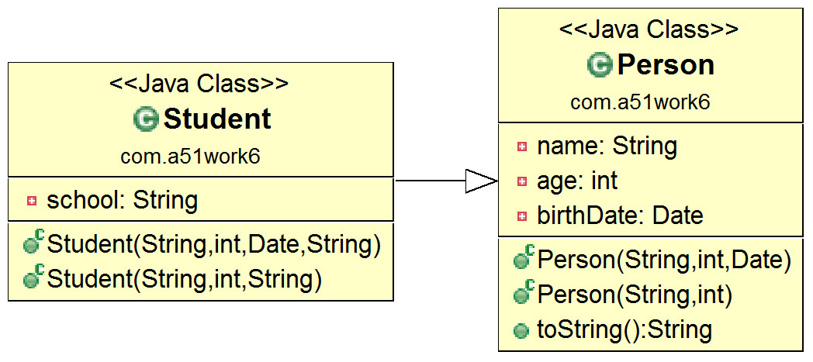

## 12.2 调用父类构造方法

当子类实例化时，不仅需要初始化子类成员变量，也需要初始化父类成员变量，初始化父类成员变量需要调用父类构造方法，子类使用super关键字调用父类构造方法。

下面看一个示例，现有父类Person和子类Student，它们类图如图12-4所示。



图12-4　Person和Student类图

父类Person代码如下：
//Person.java文件
package com.a51work6;

import java.util.Date;

public class Person {

	// 名字
	private String name;
	// 年龄
	private int age;
	// 出生日期
	private Date birthDate;

	// 三个参数构造方法
	public Person(String name, int age, Date d) {
		this.name = name;
		this.age = age;
		birthDate = d;
	}

	public Person(String name, int age) {
		// 调用三个参数构造方法
		this(name, age, new Date());
	}
	...
}
子类Student代码如下：


```java
//Student.java文件
package com.a51work6;

import java.util.Date;

public class Student extends Person {

	// 所在学校
	private String school;

	public Student(String name, int age, Date d, String school) {
		super(name, age, d);							①
		this.school = school;
	}

	public Student(String name, int age, String school) {
		// this.school = school;//编译错误
		super(name, age);								②
		this.school = school;
	}

	public Student(String name, String school) { // 编译错误		③
		// super(name, 30);
		this.school = school;
	}
}

```


在Student子类代码第①行和第②行是调用父类构造方法，代码第①行super(name, age, d)语句是调用父类的Person(String name, int age, Date d)构造方法，代码第②行super(name, age)语句是调用父类的Person(String name, int age)构造方法。

**提示 super语句必须位于子类构造方法的第一行。**

代码第③行构造方法由于没有super语句，编译器会试图调用父类默认构造方法（无参数构造方法），但是父类Person并没有默认构造方法，因此会发生编译错误。解决这个编译错误有三种办法：

1.  在父类Person中添加默认构造方法，子类Student会隐式调用父类的默认构造方法。
2.  在子类Studen构造方法添加super语句，显式调用父类构造方法，super语句必须是第一条语句。
3.  在子类Studen构造方法添加this语句，显式调用当前对象其他构造方法，this语句必须是第一条语句。