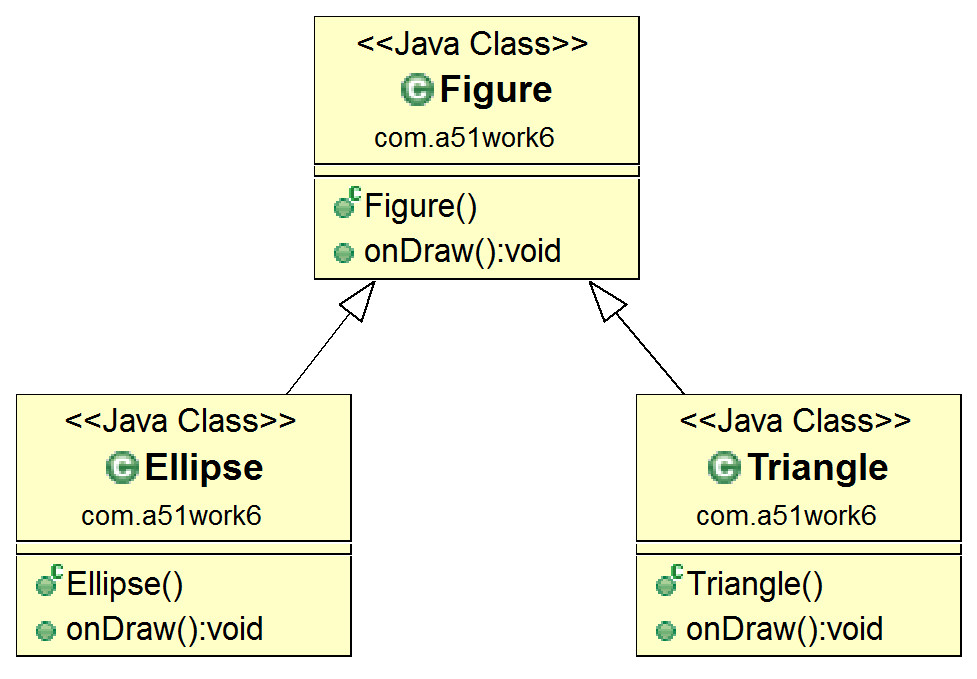
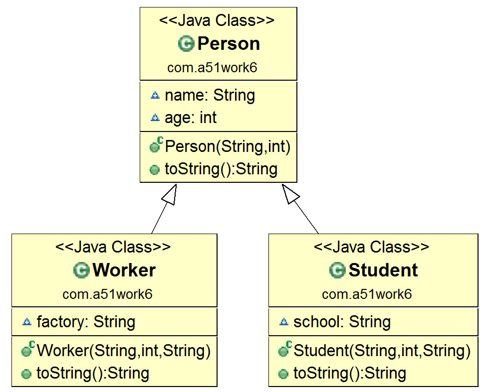

## 12.4 多态

在面向对象程序设计中多态是一个非常重要的特性，理解多态有利于进行面向对象的分析与设计。

### 12.4.1 多态概念

发生多态要有三个前提条件：

**1.  继承。多态发生一定要子类和父类之间。
2.  覆盖。子类覆盖了父类的方法。
3.  声明的变量类型是父类类型，但实例则指向子类实例。**

下面通过一个示例理解什么多态。如图12-5所示，父类Figure（几何图形）类有一个onDraw（绘图）方法，Figure（几何图形）它有两个子类Ellipse（椭圆形）和Triangle（三角形），Ellipse和Triangle覆盖onDraw方法。Ellipse和Triangle都有onDraw方法，但具体实现的方式不同。



图12-5　几何图形类图

具体代码如下：


```java
//Figure.java文件
package com.a51work6;

public class Figure {

	//绘制几何图形方法
	public void onDraw() {
		System.out.println("绘制Figure...");
	}
}

//Ellipse.java文件
package com.a51work6;

//几何图形椭圆形
public class Ellipse extends Figure {

	//绘制几何图形方法
	@Override
	public void onDraw() {
		System.out.println("绘制椭圆形...");
	}
	
}

//Triangle.java文件
package com.a51work6;

//几何图形三角形
public class Triangle extends Figure {

	// 绘制几何图形方法
	@Override
	public void onDraw() {
		System.out.println("绘制三角形...");
	}
}
```


调用代码如下：


```java
//HelloWorld.java文件
package com.a51work6;
public class HelloWorld {
	public static void main(String[] args) {

		// f1变量是父类类型，指向父类实例
		Figure f1 = new Figure();						①	
		f1.onDraw();
		
		//f2变量是父类类型，指向子类实例，发生多态
		Figure f2 = new Triangle();					②
		f2.onDraw();
		
		//f3变量是父类类型，指向子类实例，发生多态
		Figure f3 = new Ellipse();					③
		f3.onDraw();
		
		//f4变量是子类类型，指向子类实例
		Triangle f4 = new Triangle();					④
		f4.onDraw();

	}
}
```


上述带代码第②行和第③行是符合多态的三个前提，因此会发生多态。而代码第①行和第④行都不符合，没有发生多态。
运行结果如下：

	绘制Figure...
	绘制三角形...
	绘制椭圆形...
	绘制三角形...


从运行结果可知，多态发生时，Java虚拟机运行时根据引用变量指向的实例调用它的方法，而不是根据引用变量的类型调用。

### 12.4.2 引用类型检查

有时候需要在运行时判断一个对象是否属于某个引用类型，这时可以使用instanceof运算符，instanceof运算符语法格式如下：


```java
obj instanceof type
```

其中obj是一个对象，type是引用类型，如果obj对象是type引用类型实例则返回true，否则false。

为了介绍引用类型检查，先看一个示例，如同12-6所示的类图，展示了继承层次树，Person类是根类，Student是Person的直接子类，Worker是Person的直接子类。



图12-6　继承关系类图

继承层次树中具体实现代码如下：


```java
//Person.java文件
package com.a51work6;
public class Person {

	String name;
	int age;

	public Person(String name, int age) {
		this.name = name;
		this.age = age;
	}

	@Override
	public String toString() {
		return "Person [name=" + name 
				+ ", age=" + age + "]";
	}
}

//Worker.java文件
package com.a51work6;
public class Worker extends Person {

	String factory;

	public Worker(String name, int age, String factory) {
		super(name, age);
		this.factory = factory;
	}

	@Override
	public String toString() {
		return "Worker [factory=" + factory 
				+ ", name=" + name 
				+ ", age=" + age + "]";
	}
}

//Student.java文件
package com.a51work6;
public class Student extends Person {

	String school;
	
	public Student(String name, int age, String school) {
		super(name, age);
		this.school = school;
	}

	@Override
	public String toString() {
		return "Student [school=" + school 
				+ ", name=" + name 
				+ ", age=" + age + "]";
	}

}
```

调用代码如下：

```java
//HelloWorld.java文件
package com.a51work6;

public class HelloWorld {

	public static void main(String[] args) {

		Student student1 = new Student("Tom", 18, "清华大学");	①
		Student student2 = new Student("Ben", 28, "北京大学");
		Student student3 = new Student("Tony", 38, "香港大学");	②

		Worker worker1 = new Worker("Tom", 18, "钢厂");	③
		Worker worker2 = new Worker("Ben", 20, "电厂");	④

		Person[] people = { student1, student2, student3, worker1, worker2 };⑤

		int studentCount = 0;
		int workerCount = 0;

		for (Person item : people) { 	⑥
			if (item instanceof Worker) { 	⑦
				workerCount++;
			} else if (item instanceof Student) {	⑧
				studentCount++;
			}
		}		
		System.out.printf("工人人数：%d，学生人数：%d", workerCount, studentCount);
	}
}

```


上述代码第①行和第②行创建了3个Student实例，代码第③行和第④行创建了两个Worker实例，然后程序把这5个实例放入people数组中。

代码第⑥行使用for-each遍历people数组集合，当从people数组中取出元素时，元素类型是People类型，但是实例不知道是哪个子类（Student和Worker）实例。代码第⑦行item instanceof Worker表达式是判断数组中的元素是否是Worker实例；类似地，第⑧行item instanceof Student表达式是判断数组中的元素是否是Student实例。

输出结果如下：

	工人人数：2，学生人数：3
	
### 12.4.3 引用类型转换

在5.7节介绍过数值类型相互转换，引用类型可以进行转换，但并不是所有的引用类型都能互相转换，只有属于同一颗继承层次树中的引用类型才可以转换。

在上一节示例上修改HelloWorld.java代码如下：

```java
//HelloWorld.java文件
package com.a51work6;

public class HelloWorld {

	public static void main(String[] args) {

		Person p1 = new Student("Tom", 18, "清华大学");
		Person p2 = new Worker("Tom", 18, "钢厂");

		Person p3 = new Person("Tom", 28);
		Student p4 = new Student("Ben", 40, "清华大学");
		Worker p5 = new Worker("Tony", 28, "钢厂");
		...
	}
}
```

上述代码创建了3个实例p1、p2、p3、p4和p5，它们的类型都是Person继承层次树中的引用类型，p1和p4是Student实例，p2和p5是Worker实例，p3是Person实例。首先，对象类型转换一定发生在继承的前提下，p1和p2都声明为Person类型，而实例是由Person子类型实例化的。

表12-1归纳了p1、p2、p3、p4和p5这5个实例与Worker、Student和Person这3种类型之间的转换关系。

表 12-1 类型转换

| **对 象** | **Person类型** | **Worker类型** | **Student类型** | **说　　明** |
| --- | --- | --- | --- | --- |
| p1 | 支持 | 不支持 | 支持（向下转型） | 类型：Person实例：Student |
| p2 | 支持 | 支持（向下转型） | 不支持 | 类型：Person实例：Worker |
| p3 | 支持 | 不支持 | 不支持 | 类型：Person实例：Person |
| p4 | 支持（向上转型） | 不支持 | 支持 | 类型：Student实例：Student |
| p5 | 支持（向上转型） | 支持 | 不支持 | 类型：Worker实例：Worker |

作为这段程序的编写者是知道p1本质上是Student实例，但是表面上看是Person类型，编译器也无法推断p1的实例是Person、Student还是Worker。此时可以使用instanceof操作符来判断它是哪一类的实例。

引用类型转换也是通过小括号运算符实现，类型转换有两个方向：将父类引用类型变量转换为子类类型，这种转换称为向下转型（downcast）；将子类引用类型变量转换为父类类型，这种转换称为向上转型（upcast）。向下转型需要强制转换，而向上转型是自动的。

下面通过示例详细说明一下向下转型和向上转型，在HelloWorld.java的main方法中添加如下代码：

```java
// 向上转型
Person p = (Person) p4; ①

// 向下转型
Student p11 = (Student) p1; ②
Worker p12 = (Worker) p2; ③

// Student p111 = (Student) p2; //运行时异常 ④
if (p2 instanceof Student) {
	Student p111 = (Student) p2;
}
// Worker p121 = (Worker) p1;  //运行时异常 ⑤
if (p1 instanceof Worker) {
	Worker p121 = (Worker) p1;
}
// Student p131 = (Student) p3; //运行时异常 ⑥
if (p3 instanceof Student) {
	Student p131 = (Student) p3;
}
```

上述代码第①行将p4对象转换为Person类型，p4本质上是Student实例，这是向上转型，这种转换是自动的，其实不需要小括号(Person)进行强制类型转换。

代码第②行和第③行是向下类型转换，它们的转型都能成功。而代码第④、⑤、⑥行都会发生运行时异常ClassCastException，如果不能确定实例是哪一种类型，可以在转型之前使用instanceof运算符判断一下。