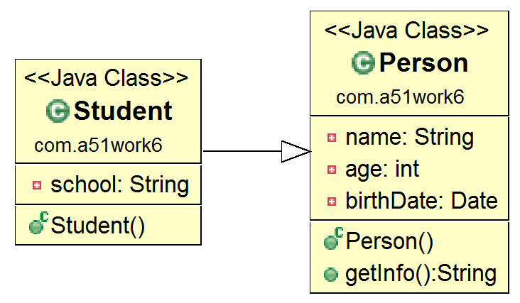
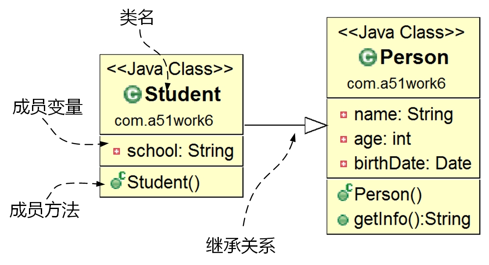
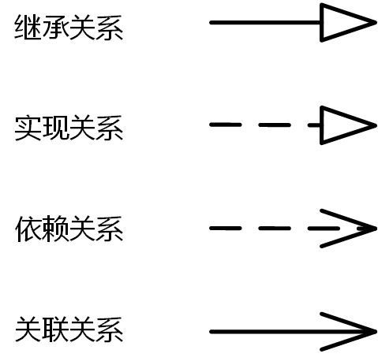

## 12.1 Java中的继承

为了了解继承性，先看这样一个场景：一位面向对象的程序员小赵，在编程过程中需要描述和处理个人信息，于是定义了类Person，如下所示：

```java
//Person.java文件
package com.a51work6;

import java.util.Date;

public class Person {

	// 名字
	private String name;
	// 年龄
	private int age;
	// 出生日期
	private Date birthDate;

	public String getInfo() {
		return "Person [name=" + name 
				+ ", age=" + age 
				+ ", birthDate=" + birthDate + "]";
	}

}
```

很多人会认为小赵的做法能够理解并相信这是可行的，但问题在于Student和Person两个类的结构太接近了，后者只比前者多了一个属性school，却要重复定义其他所有的内容，实在让人“不甘心”。Java提供了解决类似问题的机制，那就是类的继承，代码如下所示：

```java
//Student.java文件
package com.a51work6;

import java.util.Date;
public class Student extends Person {
	// 所在学校
	private String school;
}
```

Student类继承了Person类中的所有成员变量和方法，从上述代码可以见继承使用的关键字是extends，extends后面的Person是父类。

如果在类的声明中没有使用extends关键字指明其父类，则默认父类为Object类，java.lang.Object类是Java的根类，所有Java类包括数组都直接或间接继承了Object类，在Object类中定义了一些有关面向对象机制的基本方法，如equals()、toString()和finalize()等方法。

**提示 一般情况下，一个子类只能继承一个父类，这称为“单继承”，但有的情况下一个子类可以有多个不同的父类，这称为“多重继承”。在Java中，类的继承只能是单继承，而多重继承可以通过实现多个接口实现。也就是说，在Java中，一个类只能继承一个父类，但是可以实现多个接口。**

**提示 面向对象分析与设计（OOAD）时，会用到UML图[^11]，其中类图非常重要，用来描述系统静态结构。Student继承Person的类图如图12-1所示。类图中的各个元素说明如图12-2所示，类用矩形表示，一般分为上、中、下三个部分，上部分是类名，中部分是成员变量，下部分是成员方法。实线+空心箭头表示继承关系，箭头指向父类，箭头末端是子类。UML类图中还有很多关系，如图12-3所示，如图虚线＋空心箭头表示实线关系，箭头指向接口, 箭头末端是实线类。**



图12-1　Student继承Person的类图



图12-2　类图中元素



图12-3　元素之间关系

[^11]: UML是Unified Modeling Language的缩写，既统一标准建模语言。它集成了各种优秀的建模方法学发展而来的。UML图常用的有例图、协作图、活动图、序列图、部署图、构件图、类图、状态图。