## 2.2 Eclipse开发工具

Eclipse是著名的跨平台IDE工具，最初Eclipse是IBM支持开发的免费Java开发工具，2001年11月贡献给开源社区，现在它由非营利软件供应商联盟Eclipse基金会管理。Eclipse的本身也是一个框架平台，它有着丰富的插件，例如C++、Python、PHP等开发其他语言的插件。另外，Eclipse是绿色软件不需要写注册表，卸载非常方便。

### 2.2.1 Eclipse下载和安装

本书采用Eclipse 4.6[^5]版本作为IDE工具，Eclipse 4.6下载地址是http://www.eclipse.org/downloads/，如图2-10所示是Windows系统的下载Eclipse下载页面，单击“DOWNLOAD 64 bit”按钮页面会跳转到，如图2-11所示的选择下载镜像地址页面，单击Select Another Mirror连接可以改变下载镜像地址，然后单击DOWNLOAD按钮开始下载。

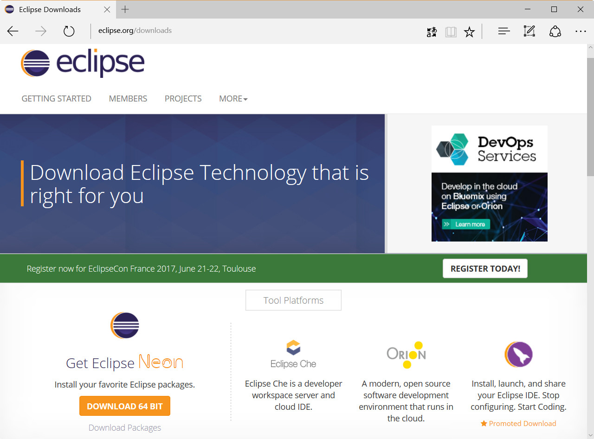

图2-10 Eclipse 4.6下载页面

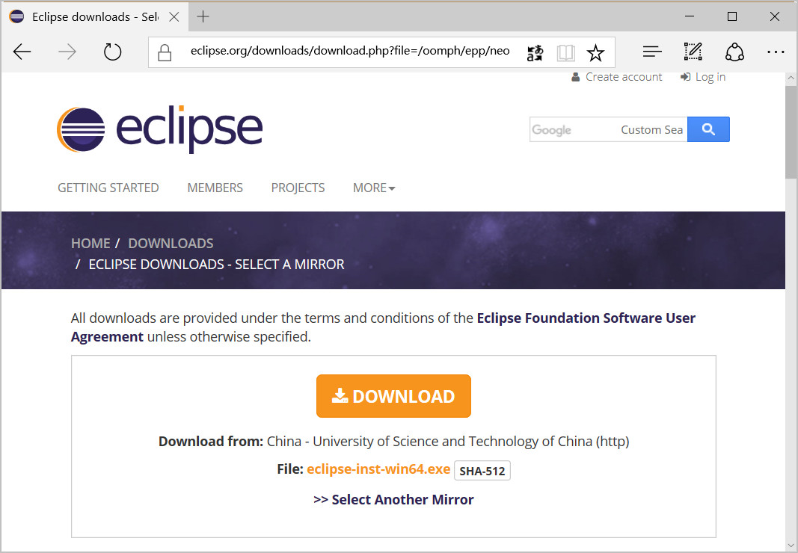

图2-11 选择下载镜像地址

下载完成后的文件是eclipse-inst-win64.exe，事实上eclipse-inst-win64.exe是安装各种Eclipse版本客户端，双击eclipse-inst-win64.exe弹出如图2-12所示的界面，选择Eclipse IDE for Java Developers进入如图2-13所示的界面，在该界面中Installation Folder可以改变安装目录，选中create start menu entry可以添加快捷方式到开始菜单，选中create desktop shortcut可以在桌面创建快捷方式，设置完成后单击INSTALL按钮开始安装，安装完成后单击LAUNCH按钮启动Eclipse。

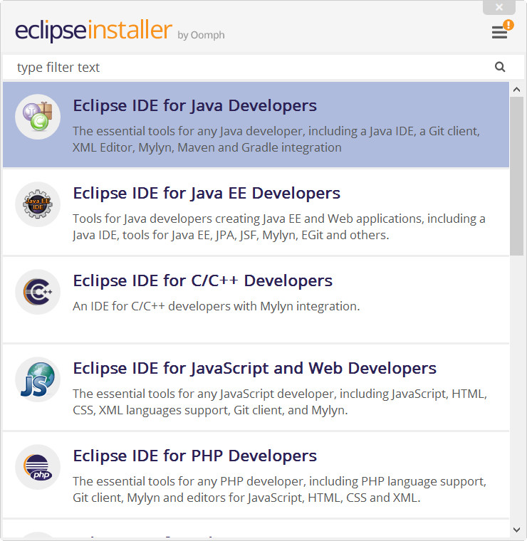

图2-12安装各种Eclipse版本客户端

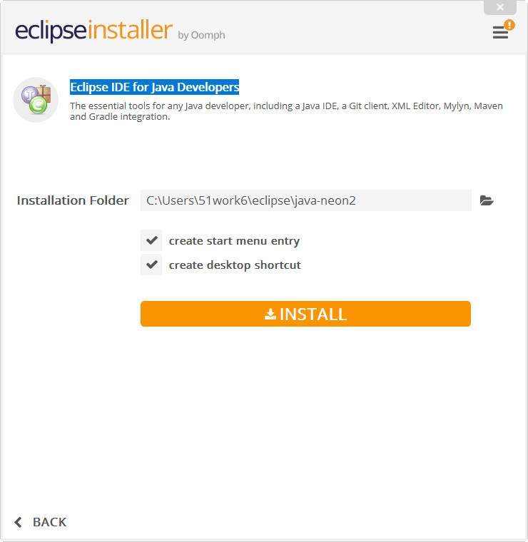

图2-13 Eclipse安装

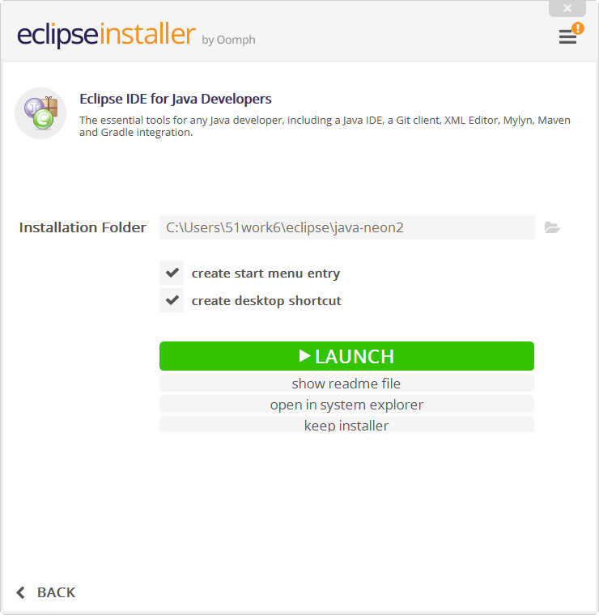

图2-14 Eclipse安装完成

在Eclipse启动过程中，会弹出如图2-15所示，选择工作空间（workspace）对话框，工作空间是用来保存工程的目录。默认情况下每次Eclipse启动时候都需要选择工作空间，如果你觉得每次启动时都选择工作空间比较麻烦，可以选中Use this as the default and to not ask again选项，设置工作空间默认目录。初次启动Eclipse成功后，会进入如图2-16所示的欢迎界面。

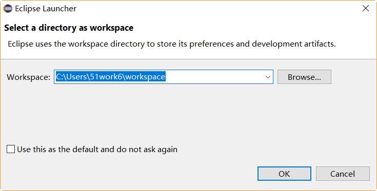

图2-15 选择工作空间

图2-16 Eclipse欢迎界面

### 2.2.2 安装中文语言包

Eclipse界面默认是英文，对于一些初学者英语界面使用起来还是有一定困难的。Eclipse平台提供了一个语言包项目——Eclipse Babel Project（http://www.eclipse.org/babel/），Babel是一个插件，安装Babel插件可以通过离线或在线安装，Babel 插件下载地址是http://www.eclipse.org/babel/downloads.php，如图2-17所示，单击Zipped p2 repository for Neon超连接下载离线包，注意离线包所支持的Eclipse版本。笔者推荐在线安装，从图2-17所示页面中可见在线安装网址是http://download.eclipse.org/technology/babel/update-site/R0.14.1/neon。

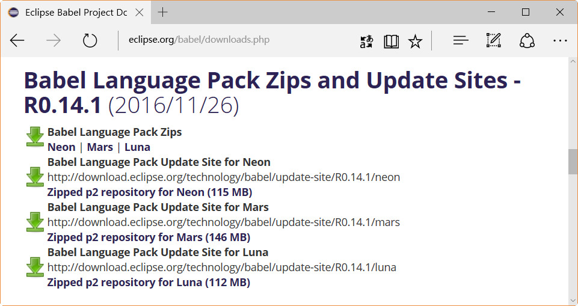

图2-17 下载Eclipse语言包

安装插件过程如下，首先启动Eclipse，选择菜单Help→Install New Software弹出如图2-18所示的对话框。单击Add按钮弹出如图2-19所示对话框，在Location中输入插件在线地址http://download.eclipse.org/technology/babel/update-site/R0.14.1/neon，如图2-20所示。

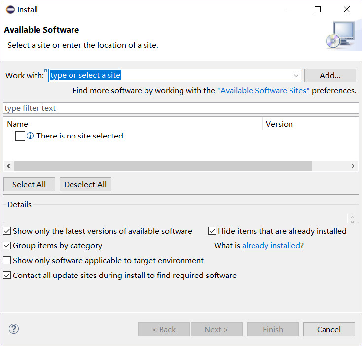

图2-18 安装插件

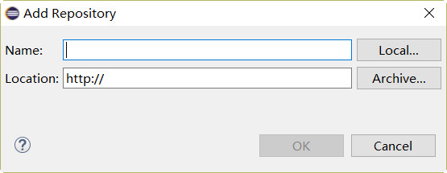

图2-19插件地址

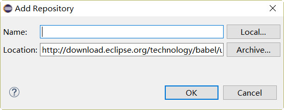

图2-20 输入插件地址

确定输入内容后单击OK按钮关闭对话，Eclipse通过刚刚输入的网址查找插件，如果能够找到插件，则出现如图2-21所示对话框，从中选择简体中文语言包。选择完成后单击Next按钮进行安装，安装过程需要从网上下载插件，这个过程需要等一段时间。

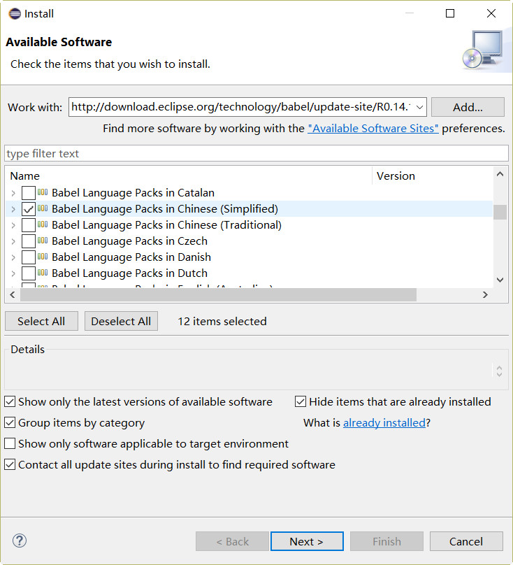

图2-21 选择简体中文语言包

安装简体中文语言包插件后重新启动Eclipse，界面如图2-22所示。

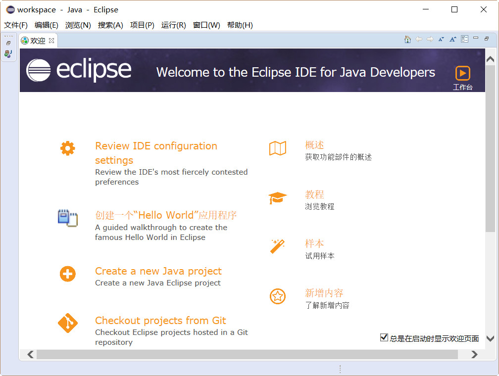

图2-22 安装简体中文语言包后Eclipse

### 2.2.3 Eclipse界面

关闭Eclipse的“欢迎”界面，并创建一个Java工程后（如何创建Java工程将在第3章介绍），可以看到如图2-23所示的主界面。该界面主要分成4个区域：

①号区域是包资源管理器视图，以包形式管理Java源文件，包是一种命名空间将在后面再详细介绍。

②号区域是代码编辑视图，编码工作就是在这里完成的。

③号区域是显示大纲等辅助视图，大纲视图中列出了当前Java类中方法和成员变量，并且单击可以快速导航到指定代码。

④号区域是显示问题、控制台等辅助视图, 问题可以列出当前工程的编译错误和警告等问题。

事实上，这4个区域视图都可以互换，只要拖曳视图标题到相应的区域。Eclipse视图标题如图2-24所示，标题的右端有两个按钮：最小化按钮和最大化按钮，单击可以实现视图的最小化和最大化显示。

图2-23 Eclipse主界面

图2-24 Eclipse视图

此外，Eclipse提供了丰富的菜单和工具栏，随着学习的深入本书会有重点地介绍，这里不再赘述。

### 2.2.4 Windows系统中常用快捷键

一个优秀的IDE开发工具应该提供丰富的快捷键，快捷键虽然不能完全替代鼠标操作，但有可以锦上添花。由于Eclipse工具提供很多快捷键，本书不打算介绍全部的快捷键，笔者总结了一些Eclipse工具在Windows系统常用的快捷键，如表2-1所示。

表 2-1 Eclipse在Windows系统常用快捷键

| **作用域** | **快捷键** | **功能** |
| --- | --- | --- |
| 全局 | Ctrl+M | 最大化/最小化当前视图 |
| 全局 | Ctrl+= | 放大视图 |
| 全局 | Ctrl+- | 缩小视图 |
| 文本编辑器 | Ctrl+F | 查找并替换 |
| 文本编辑器 | Ctrl+L | 转至某行 |
| Java编辑器 | Ctrl+Shift+F | 代码格式化 |
| Java编辑器 | Ctrl+/ | 注释/取消注释当前行 |
| Java编辑器 | Ctrl+Shift+M | 添加导入包 |
| Java编辑器 | Ctrl+Shift+O | 组织导入包 |
| Java编辑器 | Ctrl+Shift+↑ | 转至上一个成员 |
| Java编辑器 | Ctrl+Shift+↓ | 转至下一个成员 |
| Java编辑器 | Ctrl+B | 重新编译Java程序代码 |
| Java编辑器 | Ctrl+F11 | 运行上次程序 |

这些快捷键只是冰山一角，想了解更多Eclipse在Windows系统常用快捷键，读者可以参考http://baike.baidu.com/item/Eclipse快捷键指南。

[^5]: Eclipse 4.6开发代号是Neon（氖气），Eclipse开发代号的首字母是按照字母顺序排列的。Eclipse 4.7开发代号是Oxygen（氧气）。