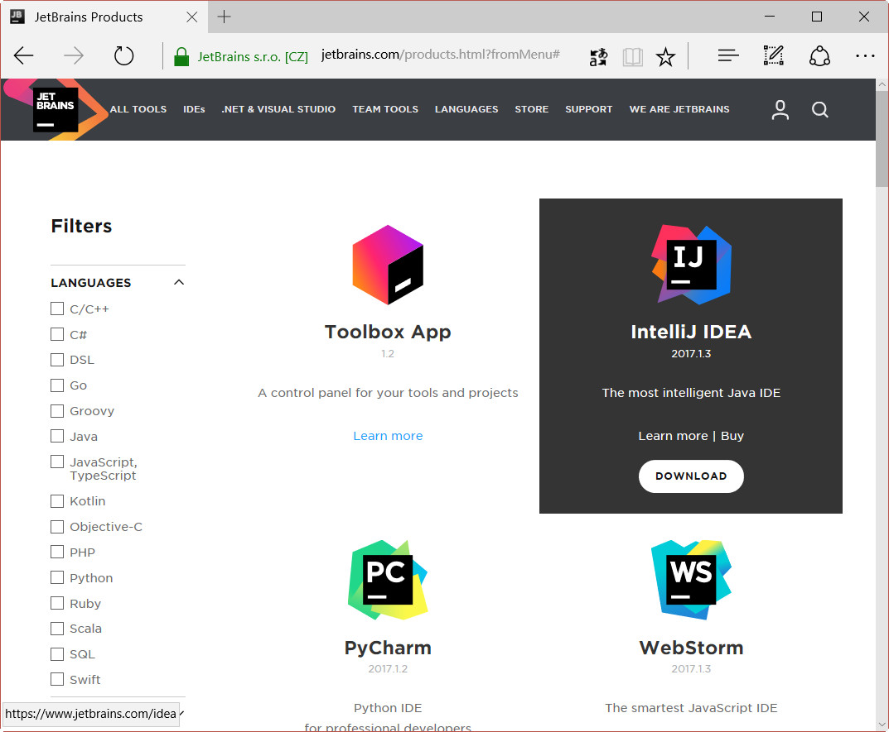
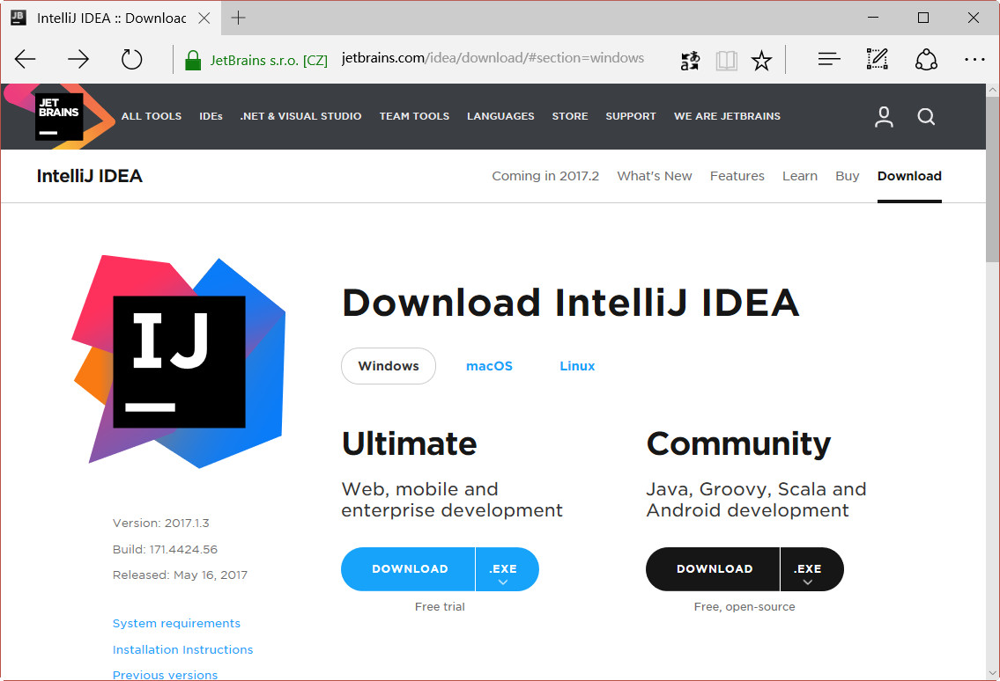
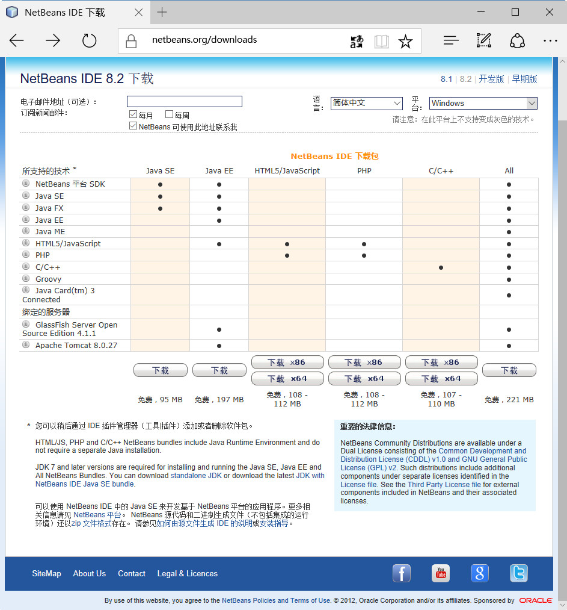
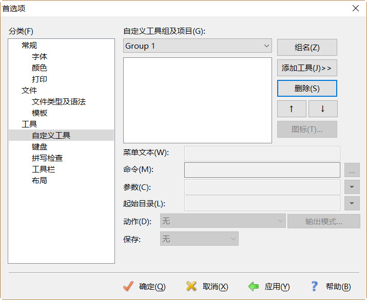
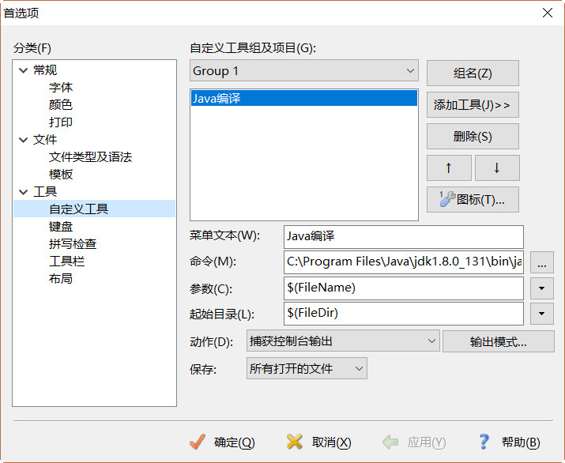
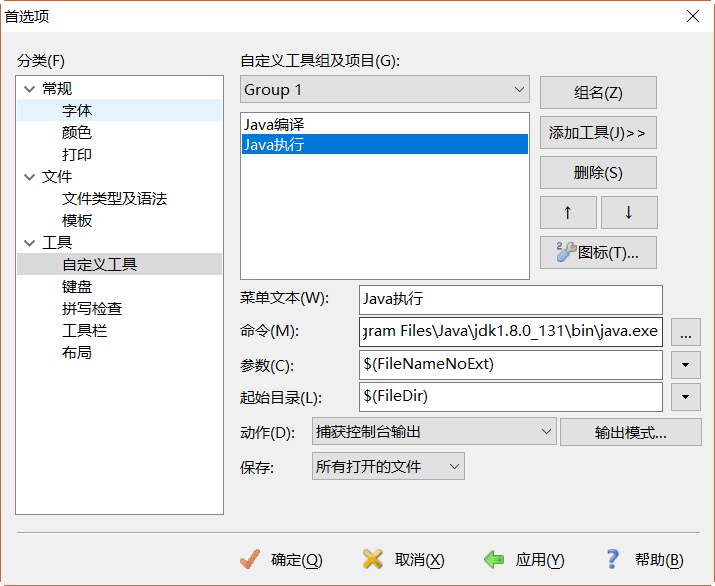
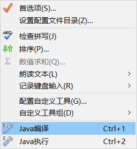
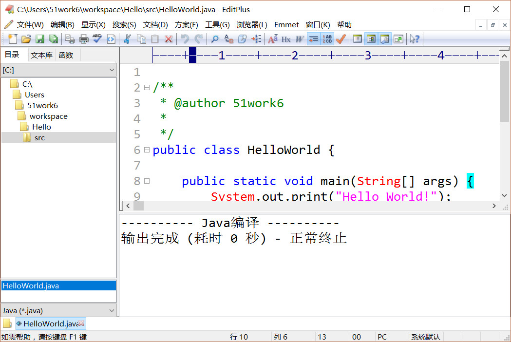
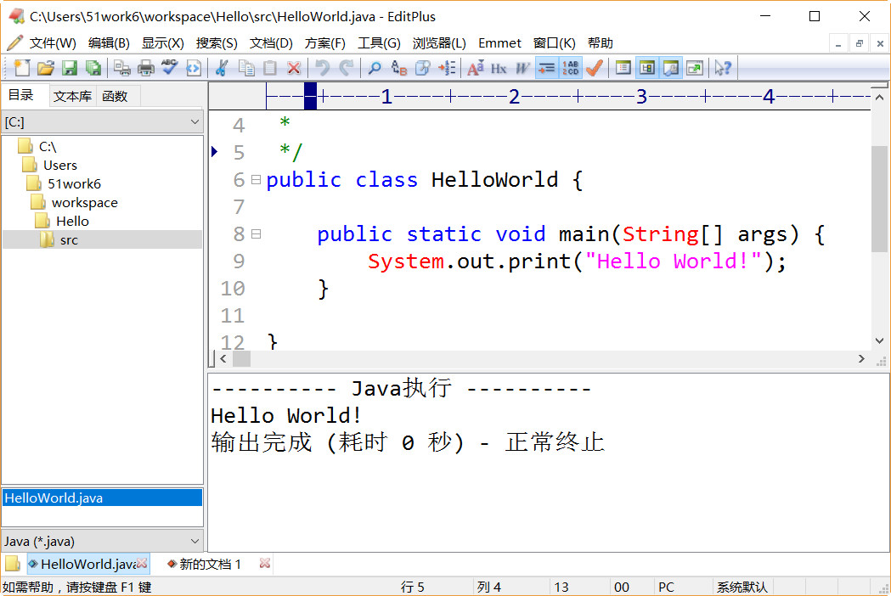

## 2.3 其他开发工具

Java IDE开发工具除了Eclipse当然还有很多，其中被广泛认可还有IntelliJ IDEA和NetBeans，令人惊奇的是它们都源自捷克人之手。

### 2.3.1 IntelliJ IDEA

虽然IntelliJ IDEA市场份额不如Eclipse，但是被很多Java专家认为是最优秀的Java IDE卡发工具。IntelliJ IDEA是Jetbrains公司（www.jetbrains.com）研发的一款Java IDE开发工具，Jetbrains是一家捷克公司，该公司开发的很多工具都好评如潮，如图2-25所示Jetbrains开发的工具，这些工具可以编写C/C++、C#、DSL、Go、Groovy、Java、JavaScript、Kotlin、Objective-C、PHP、Python、Ruby、Scala、SQL和Swift语言。

图2-25 Jetbrains公司工具

IntelliJ IDEA下载地址是https://www.jetbrains.com/idea/download/，如图2-26所示页面可以见，IntelliJ IDEA有两个版本：Ultimate（旗舰版）和Community（社区版）。旗舰版是收费的，可以免费试用30天，如果超过30天，则需要购买软件许可(License key)。社区版是完全免费的，对于学习Java语言社区版已经足够了。在图2-26页面下载IntelliJ IDEA工具，完成之后需要安装了。

图2-26 下载IntelliJ IDEA

IntelliJ IDEA工具使用起来比较复杂，而且用户群少，因此IntelliJ IDEA具体使用细节，本书不再介绍。

### 2.3.2 NetBeans IDE

NetBeans是一个始于捷克布拉格查理大学的一个学生项目（Xelfi计划），Xelfi计划延伸发展成为NetBeans IDE工具，1999年被Sun公司收购，后来随着Oracle公司收购Sun公司NetBeans IDE成为了Oracle工具产品。

被Oracle收购后NetBeans IDE仍然是免费工具，下载网址https://netbeans.org/downloads/，打开页面如图2-27所示，可以NetBeans IDE支持的平台有Windows、Mac OS X和Linux等，除完全支持所有 Java 平台（Java SE、Java EE、Java ME 和 JavaFX）之外，还支持PHP、HTML5、JavaScript、Groovy和C/C++等语言。在图2-27页面选择适合自己的版本下载NetBeans IDE工具，完成之后需要安装了。

图2-27 NetBeans IDE下载页面

NetBeans IDE工具用户群比较少，因此NetBeans IDE具体使用细节，本书不再介绍。

### 2.3.3 文本编辑工具

IDE开发工具提供了强大开发能力，提供了语法提示功能，但对于学习Java的学员而言语法提示并不是件好事，笔者建议文本编辑工具+JDK学习。开发过程就使用文本编辑工具编写Java源程序，然后使用JDK提供的javac指令编译Java源程序，再使用JDK和JRE提供的java指令运行。

提示 javac和java等指令需要在命令提示行中执行，打开命令行参考2.1.2节。

Windows平台下的文本编辑工具有很多，常用如下：

*   记事本：Windows平台自带的文本编辑工具，关键字不能高亮显示。
*   UltraEdit：历史悠久强大的文本编辑工具，可支持文本列模式等很多有用的功能，官网www.ultraedit.com。
*   EditPlus：历史悠久强大的文本编辑工具，小巧、轻便、灵活，官网www.editplus.com。
*   Sublime Text：近年来发展和壮大的文本编辑工具，所有的设置没有图形界面，在JSON格式[^6]的文件中进行的，初学者入门比较难，官网www.sublimetext.com。

除了记事本工具外，其他的UltraEdit、EditPlus和Sublime Text等工具都可以与JDK集成起来，能够在这些工具中直接，执行JDK指令。

下面重点介绍一下EditPlus与JDK集成过程。首先，打开启动EditPlus打开菜单“工具”→“首选项”，弹出首选项对话框，如图2-28所示，选择“工具”→“自定义工具”，在“自定义工具组及项目”中选择Group1组。然后通过下面的步骤添加编译和运行菜单。

####1.  添加编译菜单

在图2-28所示界面单击“添加工具”→“程序”按钮，添加一个命令菜单。如图2-29所示输入并选择相关项目，其中“菜单文本”中输入是出现在“工具”菜单中菜单名，这里可以根据需要的喜好取名字；“命令”是菜单要执行的JDK指令，这里指定JDK中javac.exe文件路径；“参数”是指，命令后面的参数，这里需要指定要编译的文件名，$(FileName)是EditPlus获得文件名的系统变量，$(FileName)是带有扩展名的文件名；“起始目录”是命令执行的目录，$(FileDir) 是EditPlus获得文件当前文件目录的系统变量；最后还需要在“动作”中选择“捕获控制台输出”，可以将命令执行结果输出到EditPlus控制台。

####2.  添加运行菜单

参考“添加编译菜单”添加过程，添加一个命令菜单。如图2-30所示，在“命令”中指定JDK中java.exe文件路径；“参数”是$(FileNameNoExt) ，表示不带扩展名的文件名。

注意：编译时指定的Java源代码文件，要带有扩展名，指令类似于javac HelloWorld.java。而运行时不需要指定字节码文件的扩展名，指令类似于java HelloWorld。

图2-28 EditPlus设置参数

图2-29 添加编译菜单

图2-30 添加执行菜单

添加成功后会发现EditPlus的工具菜单中多出了两个子菜单，如图2-31所示，Java编译和Java执行。当打开一个源程序HelloWorld.java，可通过单击Java编译菜单（或Ctrl+1快捷键）编写HelloWorld.java，如图2-32所示，编译结果输出到EditPlus控制台；然后通过单击Java执行菜单（或Ctrl+2快捷键）执行编译完成的字节码文件HelloWorld.class，如图2-33所示，运行结果输出到EditPlus控制台。

图2-31 添加后的工具菜单

图2-32 执行Java编译菜单

图2-33 执行Java运行菜单

每一种文本编辑工具的配置方式都有很大差别，这里笔者不能一一穷尽，其他工具的配置过程读者可以参考工具的官方资料。

[^6]: JSON(JavaScript Object Notation, JS对象标记) 是一种轻量级的数据交换格式，采用键值对形式，如：{&quot;firstName&quot;: &quot;John&quot;}。