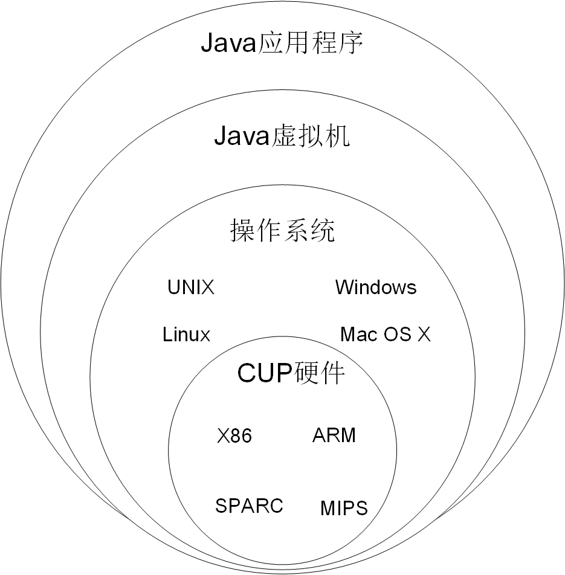

## 1.4 Java虚拟机

Java应用程序能够跨平台运行，主要是通过Java虚拟机实现的。如图1-1所示，不同软硬件平台Java虚拟机是不同的，Java虚拟机往下是不同的操作系统和CPU，使用或开发时需要下载不同的JRE或JDK版本。Java虚拟机往上是Java应用程序，Java虚拟机屏蔽了不同软硬件平台，Java应用程序不需要修改，不需要重新编译直接可以在其他平台上运行。

图1-1　Java虚拟机

Java虚拟机是中包含了Java解释器，Java程序在运行过程如图1-2所示，首先由编译器将加Java源程序文件（.java文件）编译成为字节码文件（.class文件），然后再由Java虚拟机中的解释器将字节码解释成为机器码去执行。

图1-2　Java程序运行过程