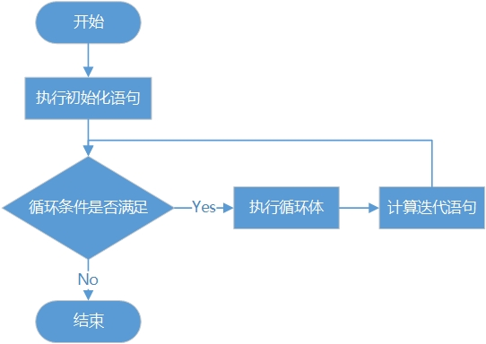

## 7.2 循环语句

循环语句能够使程序代码重复执行。Java支持三种循环构造类型：while、do-while、和for。for和while循环是在执行循环体之前测试循环条件，而do-while是在执行循环体之后测试循环条件。这就意味着for和while循环可能连一次循环体都未执行，而do-while将至少执行一次循环体。另外Java 5之后推出for-each循环语句，for-each循环是for循环的变形，它是专门为集合遍历而设计的，注意for-each并不是一个关键字。

### 7.2.1 while语句

while语句是一种先判断的循环结构，格式如下：

```java
while (循环条件) {
    语句组
}

```
while循环没有初始化语句，循环次数是不可知的，只要循环条件满足，循环就会一直进行下去。

下面看一个简单的示例，代码如下：

```java
int i = 0;
while (i * i < 100000) {
    i++;
}

System.out.println("i = " + i);
System.out.println("i * i = " + (i * i));

```

输出结果如下：

    i = 317
    i * i = 100489
    
上述程序代码的目的是找到平方数小于100000的最大整数。使用while循环需要注意几点，while循环条件语句中只能写一个表达式，而且是一个布尔型表达式，那么如果循环体中需要循环变量，就必须在while语句之前对循环变量进行初始化。本例中先给i赋值为0，然后在循环体内部必须通过语句更改循环变量的值，否则将会发生死循环。

### 7.2.2 do-while语句

do-while语句的使用与while语句相似，不过do-while语句是事后判断循环条件结构，语句格式如下：

```java
do {
　　语句组
} while (循环条件)
```
do-while循环没有初始化语句，循环次数是不可知的，不管循环条件是否满足，都会先执行一次循环体，然后再判断循环条件。如果条件满足则执行循环体，不满足则停止循环。

下面看一个示例代码：

```java
int i = 0;
do {
    i++;
} while (i * i < 100000);

System.out.println("i = " + i);
System.out.println("i * i = " + (i * i));
```
输出结果如下：

    i = 317
    i * i = 100489
    
该示例与上一节的示例是一样的，都是找到平方数小于100000的最大整数。输出结果也是一样的。

### 7.2.3 for语句

for语句是应用最广泛、功能最强的一种循环语句。一般格式如下：

```java
for (初始化; 循环条件; 迭代) {
　　语句组
}

```
for语句执行流程如图7-1所示，首先会先执行初始化语句，它的作用是初始化循环变量和其他变量，然后程序会判断循环条件是否满足，如果满足，则继续执行循环体并计算迭代语句，之后再判断循环条件，如此反复，直到判断循环条件不满足时跳出循环。



图7-1　for循环执行流程图

以下示例代码是计算1~9的平方表程序：

```java
System.out.println("---------");

for (int i = 1; i < 10; i++)  {
    System.out.printf("%d x %d = %d", i, i, i * i);
    //打印一个换行符，实现换行
    System.out.println();
}
```

输出结果如下：

    ---------
    1 x 1 = 1
    2 x 2 = 4
    3 x 3 = 9
    4 x 4 = 16
    5 x 5 = 25
    6 x 6 = 36
    7 x 7 = 49
    8 x 8 = 64
    9 x 9 = 81
    
在这个程序的循环部分初始时，给循环变量i赋值为1，每次循环都要判断i的值是否小于10，如果为true，则执行循环体，然后给i加1。因此，最后的结果是打印出1~9的平方，不包括10。
**
提示 初始化、循环条件以及迭代部分都可以为空语句（但分号不能省略），三者均为空的时候，相当于一个无限循环。代码如下：**

```java
for (; ;) {
    ...
}
```

另外，在初始化部分和迭代部分，可以使用逗号语句来进行多个操作。逗号语句是用逗号分隔的语句序列，如下程序代码所示：

```java
int x;
int y;

for (x = 0, y = 10; x < y; x++, y--) {
    System.out.printf("(x,y) = (%d, %d)", x, y);
    // 打印一个换行符，实现换行
    System.out.println();
}
```
输出结果如下：

    (x,y) = (0,10)
    (x,y) = (1,9)
    (x,y) = (2,8)
    (x,y) = (3,7)
    (x,y) = (4,6)
    
### 7.2.4 for-each语句

Java 5之后提供了一种专门用于遍历集合的for循环——for-each循环。使用for-each循环不必按照for的标准套路编写代码，只需要提供一个集合就可以遍历。

假设有一个数组，采用for语句遍历数组的方式如下：

```java
// 声明并初始化int数组
int[] numbers = { 43, 32, 53, 54, 75, 7, 10 };

System.out.println("----for-------");
// for语句
for (int i = 0; i < numbers.length; i++) {
	System.out.println("Count is:" + numbers[i]);
}

```
上述语句int[] numbers = { 43, 32, 53, 54, 75, 7, 10 }声明并初始化了10个元素数组集合，目前大家只需要知道当初始化数组时，要把相同类型的元素放到{…}中并且用逗号分隔（,）即可，关于数组集合会在后面第8章详细介绍。numbers.length是获得数组的长度，length是数组的属性，numbers[i]是通过数组下标访问数组元素。

那么采用for-each循环语句遍历数组的方式如下：

```java
// 声明并初始化int数组
int[] numbers = { 43, 32, 53, 54, 75, 7, 10 };

System.out.println("----for each----");
// for-each语句
for (int item : numbers) {
	System.out.println("Count is:" + item);
}
```
从示例中可以发现，item不是循环变量，它保存了集合中的元素，的for-each语句将集合中的元素一一取出来，并保存到item中，这个过程中不需要使用循环变量，通过数组下标访问数组中的元素。可见for-each语句在遍历集合的时候要简单方便得多。