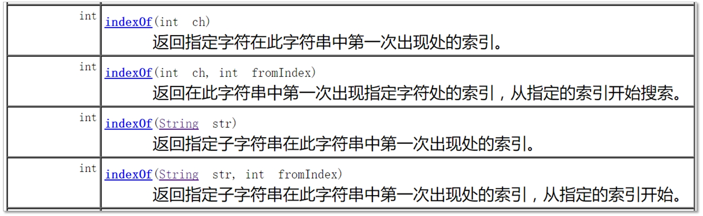

## 10.5 方法重载（Overload）

在第10章介绍字符串时就已经用到过方法重载，这一节详细介绍一下重载。出于使用方便等原因，在设计一个类时将具有相似功能的方法起相同的名字。例如String字符串查找方法indexOf有很多不同版本，如图10-3所示：



图10-3　indexOf方法重载

这些相同名字的方法之所以能够在一个类中同时存在，是因为它们的方法参数列表，调用时根据参数列表调用相应重载方法。

**提示 方法重载中参数列表不同的含义是：参数的个数不同或者是参数类型不同。另外，返回类型不能用来区分方法重载。**

方法重载示例MethodOverloading.java代码如下：

```java
// MethodOverloading.java文件
package com.a51work6;

class MethodOverloading {

	void receive(int i) {	①
		System.out.println("接收一个int参数");
		System.out.println("i = " + i);
	}

	void receive(int x, int y) {	②
		System.out.println("接收两个int参数");
		System.out.printf("x = %d, y = %d \r", x, y);
	}
	
	int receive(double x, double y) {	③
		System.out.println("接收两个double参数");
		System.out.printf("x = %f, y = %f \r", x, y);
		return 0;
	}
}

// HelloWorld.java文件调用MethodOverloading
package com.a51work6;

public class HelloWorld {
	public static void main(String[] args) {
		
		MethodOverloading mo = new MethodOverloading();	

		//调用void receive(int i)		
		mo.receive(1); ④
		
		//调用void receive(int x, int y)		
		mo.receive(2, 3); ⑤
		
		//调用void receive(double x, double y)
		mo.receive(2.0, 3.3);	⑥
	}
}
```

MethodOverloading类中有三个相同名字的receive方法，在HelloWorld的main方法中调用MethodOverloading的receive方法。运行结果如下：

	接收一个int参数
	i = 1
	接收两个int参数
	x = 2, y = 3 
	接收两个double参数
	x = 2.000000, y = 3.300000


调用哪一个receive方法是根据参数列表决定的。如果参数类型不一致，编译器会进行自动类型转换寻找适合版本的方法，如果没有适合方法，则会发生编译错误。假设删除代码第②行的void receive(int x, int y)方法，代码第⑤行的mo.receive(2, 3)语句调用的是void receive(double x, double y)方法，其中int类型参数（2和3）自动会转换为double类型（2.0和3.0）再调用。