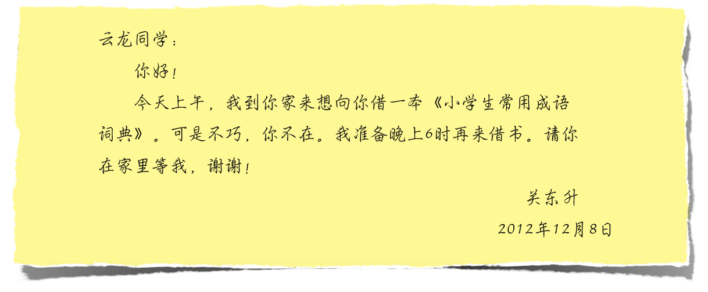
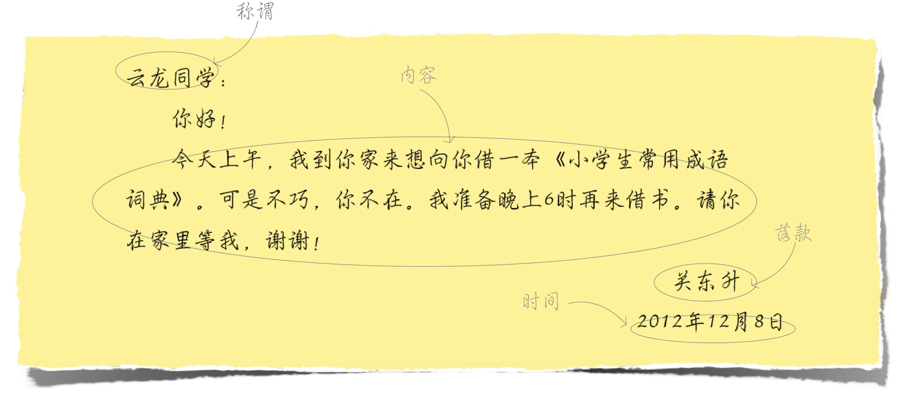
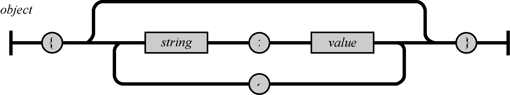
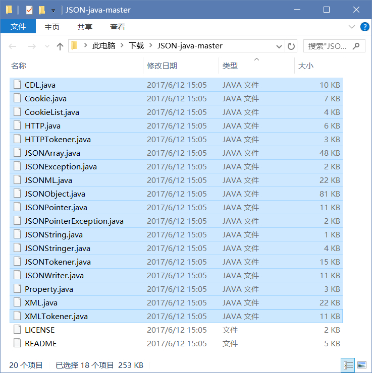
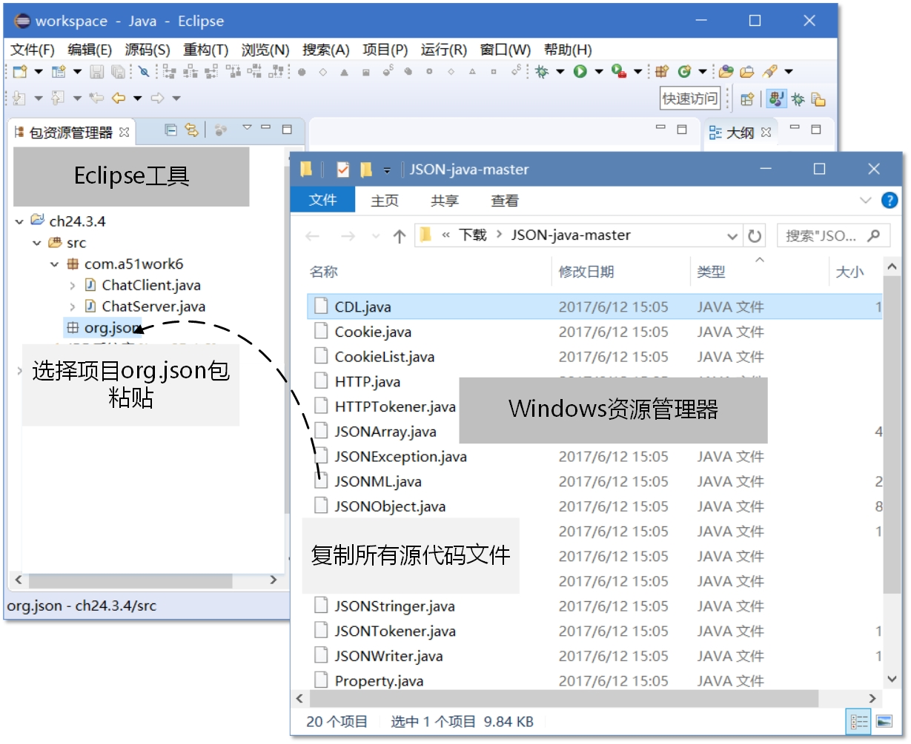

## 17.2 数据交换格式

数据交换格式就像两个人在聊天一样，采用彼此都能听得懂的语言，你来我往，其中的语言就相当于通信中的数据交换格式。有时候，为了防止聊天被人偷听，可以采用暗语。同理，计算机程序之间也可以通过数据加密技术防止“偷听”。

数据交换格式主要分为纯文本格式、XML格式和JSON格式，其中纯文本格式是一种简单的、无格式的数据交换方式。

例如，为了告诉别人一些事情，我会写下如图17-3所示的留言条。


图17-3　留言条

留言条有一定的格式，共有4部分：称谓、内容、落款和时间，如图17-4所示。


图17-4　留言条格式

如果用纯文本格式描述留言条，可以按照如下的形式：

```son
"云龙同学","你好！\n今天上午，我到你家来想向你借一本《小学生常用成语词典》。可是不巧，你不在。我准备晚上6时再来借书。请你在家里等我，谢谢！","关东升","2012年12月08日"
```

留言条中的4部分数据按照顺序存放，各个部分之间用逗号分割。数据量小的时候，可以采用这种格式。但是随着数据量的增加，问题也会暴露出来，可能会搞乱它们的顺序，如果各个数据部分能有描述信息就好了。而XML格式和JSON格式可以带有描述信息，它们叫做“自描述的”结构化文档。

将上面的留言条写成XML格式，具体如下：

```xml
<?xml version="1.0" encoding="UTF-8"?>
<note>
    <to>云龙同学</to>
    <conent>你好！\n今天上午，我到你家来想向你借一本《小学生常用成语词典》。
        可是不巧，你不在。我准备晚上6时再来借书。请你在家里等我，谢谢！</conent>
    <from>关东升</from>
    <date>2012年12月08日</date>
</note>
```

中位于尖括号中的内容就是描述数据的标识，在XML中称为“标签”。

将上面的留言条写成JSON格式，具体如下：

```json
{
    to: "云龙同学",
    conent: "你好！\n今天上午，我到你家来想向你借一本《小学生常用成语词典》。可是不巧，你不在。我准备晚上6时再来借书。请你在家里等我，谢谢！",
    from: "关东升",
    date: "2012年12月08日"
}
```

数据放置在大括号{}之中，每个数据项目之前都有一个描述名字（如to等），描述名字和数据项目之间用冒号（:）分开。

可以发现，一般来讲，JSON所用的字节数要比XML少，这也是很多人喜欢采用JSON格式的主要原因，因此JSON也被称为“轻量级”的数据交换格式。接下来，重点介绍JSON数据交换格式。

### 17.2.1 JSON文档结构

JSON（JavaScript Object Notation）是一种轻量级的数据交换格式。所谓轻量级，是与XML文档结构相比而言的，描述项目的字符少，所以描述相同数据所需的字符个数要少，那么传输速度就会提高，而流量却会减少。

如果留言条采用JSON描述，可以设计成下面的样子：

```json
{
    "to": "云龙同学",
    "conent": "你好！\n今天上午，我到你家来想向你借一本《小学生常用成语词典》。可是不巧，你不在。我准备晚上6时再来借书。请你在家里等我，谢谢！",
    "from": "关东升",
    "date": "2012年12月08日"
}
```

由于Web和移动平台开发对流量的要求是要尽可能少，对速度的要求是要尽可能快，而轻量级的数据交换格式JSON就成为理想的数据交换格式。

构成JSON文档的两种结构为对象和数组。对象是“名称-值”对集合，它类似于Java中Map类型，而数组是一连串元素的集合。

对象是一个无序的“名称/值”对集合，一个对象以{（左括号）开始，}（右括号）结束。每个“名称”后跟一个:（冒号），“名称-值”对之间使用,（逗号）分隔。JSON对象的语法表如图17-5所示。



图17-5　JSON对象的语法表

下面是一个JSON对象的例子：

```java
{
    "name":"a.htm",
    "size":345,
    "saved":true
}
```

数组是值的有序集合，以[（左中括号）开始，]（右中括号）结束，值之间使用,（逗号）分隔。JSON数组的语法表如图17-6所示。


图17-6　JSON数组的语法表

下面是一个JSON数组的例子：

[&quot;text&quot;,&quot;html&quot;,&quot;css&quot;]

在数组中，值可以是双引号括起来的字符串、数值、true、false、null、对象或者数组，而且这些结构可以嵌套。数组中值的JSON语法结构如图17-7所示。


图17-7　JSON值的语法结构图

### 17.2.2 使用第三方JSON库

由于目前Java官方没有提供JSON编码和解码所需要的类库，所以需要使用第三方JSON库，笔者推荐JSON-java库，JSON-java库提供源代码，最重要的是不依赖于其他第三方库，需要再起找其他的库了。读者可以在https://github.com/stleary/JSON-java下载源代码。API在线问档http://stleary.github.io/JSON-java/index.html。

下载JSON-java获得源代码文件，解压后文件如图17-8所示。


图17-8　JSON-java源代码文件

将JSON-java库源代码文件添加到工程中，需要两个步骤：

#####1.  创建org.json包

JSON-java库中的源代码文件都隶属于org.json包，从图17-8可见源文件夹下没有与包对应的目录结构，为此需要在Eclipse的项目中创建org.json包。选择Eclipse项目的src源代码文件夹，右击菜单中选择“新建”→“包”，弹出新建包对话框，如图17-9所示在名称的中输入org.json，然后单击完成，就成功创建org.json包。

图17-9　在Eclipse中创建包

#####2.  复制源代码文件

org.json包创建好后，需要将JSON-java库文件夹中的源代码文件复制到Eclipse工程的org.json包中。由于操作系统的资源管理器与Eclipse工具之间互相复制粘贴，Eclipse中复制和粘贴操作的快捷键和右键菜单与操作系统下完全一样。如图17-10所示，将源代码文件复制到Eclipse中。



图17-10　复制源代码文件到Eclipse工程

### 17.2.3 JSON数据编码和解码

JSON和XML真正在进行数据交换时候，它们存在的形式就是一个很长的字符串，这个字符串在网络中传输或者存储于磁盘等介质中。在传输和存储之前需要把JSON对象转换成为字符串才能传输和存储，这个过程称之为“编码”过程。接收方需要将接收到的字符串转换成为JSON对象，这个过程称之为“解码”过程。编码和解码过程就像发电报时发送方把语言变成能够传输的符号，而接收时要将符号转换成为能够看懂的语言。

下面具体介绍一下JSON数据编码和解码过程。

####1.  编码

如果想获得如下这样JSON字符串：

```json 
{"name": "tony", "age": 30, "a": [1, 3]}
```
应该如何实现编码过程，参考代码如下：


```java
try {
    JSONObject jsonObject = new JSONObject();	①
    jsonObject.put("name", "tony");	②
    jsonObject.put("age", 30);	③

    JSONArray jsonArray = new JSONArray(); ④
    jsonArray.put(1).put(3); ⑤
    jsonObject.put("a", jsonArray); ⑥
    //编码完成
    System.out.println(jsonObject.toString());	⑦
} catch (JSONException e) {
    e.printStackTrace();
}

```


上述代码第①行是创建JSONObject（JSON对象），代码第②行和第③行是把JSON数据项添加到JSON对象jsonObject中，代码第④行创建JSONArray（JSON数组），代码第⑤行是向JSON数组中添加1和3两个元素。代码第⑥是将JSON数组jsonArray作为JSON对象jsonObject的数据项添加到JSON对象。

代码第⑦行jsonObject.toString()是将JSON对象转换为字符串，真正完成了JSON编码过程。

#####2.  解码

解码过程是编码反向操作，如果有如下JSON字符串：

```json
{"name":"tony", "age":30, "a":[1, 3]}
```

那么如何把这个JSON字符串解码成JSON对象或数组，参考代码如下：

```java
String jsonString = "{\"name\":\"tony\", \"age\":30, \"a\":[1, 3]}";	①
try {
    JSONObject jsonObject = new JSONObject(jsonString); ②
    String name = jsonObject.getString("name"); ③
    System.out.println("name : " + name);
    int age = jsonObject.getInt("age");
    System.out.println("age : " + age);
    JSONArray jsonArray = jsonObject.getJSONArray("a"); ④
    int n1 = jsonArray.getInt(0); ⑤
    System.out.println("数组a第一个元素 : " + n1);
    int n2 = jsonArray.getInt(1);
    System.out.println("数组a第二个元素 : " + n2);
} catch (JSONException e) {
    e.printStackTrace();
}

```

上述代码第①行是声明一个JSON字符串，网络通信过程中JSON字符串是从服务器返回的。代码第②行通过JSON字符串创建JSON对象，这个过程事实上就是JSON字符串解析过程，如果能够成功地创建JSON对象，说明解析成功，如果发生异常则说明解析失败。

代码第③行从JSON对象中按照名称取出JSON中对应的数据。代码第④行是取出一个JSON数组对象，代码第⑤行取出JSON数组第一个元素。

**注意 如果按照规范的JSON文档要求，每个JSON数据项目的“名称”必须使用双引号括起来，不能使用单引号或没有引号。在下面的代码文档中，“名称”省略了双引号，该文档在其他平台解析时会出现异常，而在Java平台则可以通过，这得益于Java解析类库的强大，但这并不是规范的做法。如果与其他平台进行数据交换时，采用这种不规范的JSON文档进行数据交换，那么很有可能会导致严重的问题发生。**


```java
{ResultCode:0,Record:[
	{ID:'1',CDate:'2012-12-23',Content:'发布iOSBook0',UserID:'tony'},
	{ID:'2',CDate:'2012-12-24',Content:'发布iOSBook1',UserID:'tony'}]}。
```
