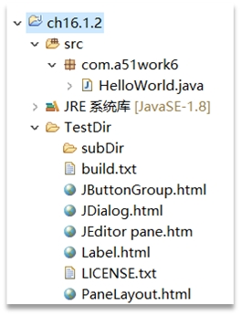

## 16.1 文件管理

Java语言使用File类对文件和目录进行操作，查找文件时需要实现FilenameFilter或FileFilter接口。另外，读写文件内容可以通过FileInputStream、FileOutputStream、FileReader和FileWriter类实现，它们属于I/O流，下一节会详细介绍I/O流。这些类和接口全部来源于java.io包。

### 16.1.1 File类

File类表示一个与平台无关的文件或目录。File类名很有欺骗性，初学者会误认为是File对象只是一个文件，但它也可能是一个目录。

File类中常用的方法如下。

#####1.  构造方法

*   File(String path)：如果path是实际存在的路径，则该File对象表示的是目录；如果path是文件名，则该File对象表示的是文件。
*   File(String path, String name)：path是路径名，name是文件名。
*   File(File dir, String name)：dir是路径对象，name是文件名。

#####2.  获得文件名

*   String getName( )：获得文件的名称，不包括路径。
*   String getPath( )：获得文件的路径。
*   String getAbsolutePath( )：获得文件的绝对路径。
*   String getParent( )：获得文件的上一级目录名。

#####3.  文件属性测试

*   boolean exists( )：测试当前File对象所表示的文件是否存在。
*   boolean canWrite( )：测试当前文件是否可写。
*   boolean canRead( )：测试当前文件是否可读。
*   boolean isFile( )：测试当前文件是否是文件。
*   boolean isDirectory( )：测试当前文件是否是目录。

#####4.  文件操作

*   long lastModified( )：获得文件最近一次修改的时间。
*   long length( )：获得文件的长度，以字节为单位。
*   boolean delete( )：删除当前文件。成功返回 true，否则返回false。
*   boolean renameTo(File dest)：将重新命名当前File对象所表示的文件。成功返回 true，否则返回false。

#####5.  目录操作

*   boolean mkdir( )：创建当前File对象指定的目录。
*   String[] list()：返回当前目录下的文件和目录，返回值是字符串数组。
*   String[] list(FilenameFilter filter)：返回当前目录下满足指定过滤器的文件和目录，参数是实现FilenameFilter接口对象，返回值是字符串数组。
*   File[] listFiles()：返回当前目录下的文件和目录，返回值是File数组。
*   File[] listFiles(FilenameFilter filter)：返回当前目录下满足指定过滤器的文件和目录，参数是实现FilenameFilter接口对象，返回值是File数组。
*   File[] listFiles(FileFilter filter)：返回当前目录下满足指定过滤器的文件和目录，参数是实现FileFilter接口对象，返回值是File数组。

对目录操作有两个过滤器接口：FilenameFilter和FileFilter。它们都只有一个抽象方法accept，FilenameFilter接口中的accept方法如下：

*   boolean accept(File dir, String name)：测试指定dir目录中是否包含文件名为name的文件。

FileFilter接口中的accept方法如下：

*   boolean accept(File pathname)：测试指定路径名是否应该包含在某个路径名列表中。

**注意 路径中会用到路径分隔符，路径分隔符在不同平台上是有区别的，UNIX、Linux和macOS中使用正斜杠“/”，而Windows下使用反斜杠“\”。Java是支持两种写法，但是反斜杠“\”属于特殊字符，前面需要加转义符。例如C:\Users\a.java在程序代码中应该使用C:\ \Users\\a.java表示，或表示为C:/Users/a.java也可以。**

### 16.1.2 案例：文件过滤

为熟悉文件操作，本节介绍一个案例，该案例从指定的目录中列出文件信息。代码如下：

```java
//HelloWorld.java文件
package com.a51work6;

import java.io.File;
import java.io.FilenameFilter;

public class HelloWorld {

	public static void main(String[] args) {

		// 用File对象表示一个目录,.表示当前目录
		File dir = new File("./TestDir"); ①
		// 创建HTML文件过滤器
		Filter filter = new Filter("html"); ②

		System.out.println("HTML文件目录：" + dir);
		// 列出目录TestDir下，文件后缀名为HTML的所有文件
		String files[] = dir.list(filter); //dir.list();						
		// 遍历文件列表
		for (String fileName : files) {
			// 为目录TestDir下的文件或目录创建File对象
			File f = new File(dir, fileName);						
			// 如果该f对象是文件，则打印文件名
			if (f.isFile()) {
				System.out.println("文件名：" + f.getName());			
				System.out.println("文件绝对路径：" + f.getAbsolutePath());
				System.out.println("文件路径：" + f.getPath());
			} else {
				System.out.println("子目录：" + f);
			}
		}

	}
}

// 自定义基于文件扩展名的文件过滤器
class Filter implements FilenameFilter { ③		

	// 文件扩展名
	String extent;

	// 构造方法
	Filter(String extent) {
		this.extent = extent;
	}

	@Override
	public boolean accept(File dir, String name) { ④
		// 测试文件扩展名是否为extent所指定的
		return name.endsWith("." + extent);						
	}
}

```

上述代码第①行创建TestDir目录对象，&quot;./TestDir&quot;表示当前目录下的TestDir目录，还可以表示为&quot;.\\TestDir&quot;和&quot;TestDir&quot;。

**提示 在编程时尽量使用相对路径，尽量不要使用绝对路径。&quot;./TestDir&quot;就是相对路径，相对路径中会用到点“.”，在目录中一个点“.”表示当前目录，两个点表示“..”表示父目录。**

**注意 在Eclipse工具中运行的Java程序，那么当前目录在哪里呢？例如&quot;./TestDir&quot;表示当前目录下的TestDir子目录，那么应该在哪里创建TestDir目录呢？在Eclipse中当前目录就是工程的根目录，如同16-1所示，当前目录是Eclipse工程根目录，子目录TestDir位于工程根目录下。**



图16-1　Eclipse中的当前目录

上述代码第②行创建针对HTML文件过滤器Filter，Filter类要求实现FilenameFilter接口，见代码第⑤行。FilenameFilter接口要求实现抽象方法accept，见代码第④行，在该方法中通过判断文件名是否指定的扩展名结尾则返回true，否则返回false。