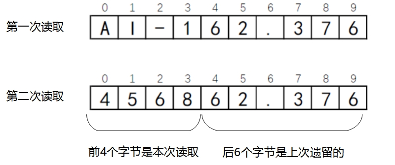

## 16.3 字节流

上一节总体概述了Java中I/O流层次结构技术，本节详细介绍一下字节流的API。掌握字节流的API先要熟悉它的两个抽象类：InputStream 和OutputStream，了解它们有哪些主要的方法。

### 16.3.1 InputStream抽象类

InputStream是字节输入流的根类，它定义了很多方法，影响着字节输入流的行为。下面详细介绍一下。

InputStream主要方法如下：

*   int read()：读取一个字节，返回0到255范围内的int字节值。如果因为已经到达流末尾，而且没有可用的字节，则返回值-1。
*   int read(byte b[] )：读取多个字节，数据放到字节数组b中，返回值为实际读取的字节的数量，如果因为已经到达流末尾，而且没有可用的字节，则返回值-1。
*   int read(byte b[ ], int off, int len)：最多读取len个字节，数据放到以下标off开始字节数组b中，将读取的第一个字节存储在元素b[off]中，下一个存储在b[off+1]中，依次类推。返回值为实际读取的字节的数量，如果因为已经到达流末尾，而且没有可用的字节，则返回值-1。
*   void close()：流操作完毕后必须关闭。

上述所有方法都可以会抛出IOException，因此使用时要注意处理异常。

### 16.3.2 OutputStream抽象类

OutputStream是字节输出流的根类，它定义了很多方法，影响着字节输出流的行为。下面详细介绍一下。

OutputStream主要方法如下：

*   void write(int b)：将b写入到输出流，b是int类型占有32位，写入过程是写入b 的8个低位，b的24个高位将被忽略。
*   void write(byte b[ ])：将b.length个字节从指定字节数组b写入到输出流。
*   void write(byte b[ ], int off, int len)：把字节数组b中从下标off开始，长度为len的字节写入到输出流。
*   void flush()：刷空输出流，并输出所有被缓存的字节。由于某些流支持缓存功能，该方法将把缓存中所有内容强制输出到流中。
*   void close( )：流操作完毕后必须关闭。

上述所有方法都声明抛出IOException，因此使用时要注意处理异常。

**注意 流（包括输入流和输出流）所占用的资源，不能通过JVM的垃圾收集器回收，需要程序员自己释放。一种方法是可以在finally代码块调用close()方法关闭流，释放流所占用的资源。另一种方法通过自动资源管理技术管理这些流，流（包括输入流和输出流）都实现了AutoCloseable接口，可以使用自动资源管理技术，具体内容参考14.4.2节。
**
### 16.3.3 案例：文件复制

前面介绍了两种字节流常用的方法，下面通过一个案例熟悉一下它们的使用，该案例实现了文件复制，数据源是文件，所以会用到文件输入流FileInputStream，数据目的地也是文件，所以会用到文件输出流FileOutputStream。

FileInputStream和FileOutputStream中主要方法都是继承自InputStream和OutputStream前面两个节已经详细介绍了，这里不再赘述。下面介绍一下它们的构造方法，FileInputStream构造方法主要有：

*   FileInputStream(String name)：创建FileInputStream对象，name是文件名。如果文件不存在则抛出FileNotFoundException异常。
*   FileInputStream(File file)：通过File对象创建FileInputStream对象。如果文件不存在则抛出FileNotFoundException异常。

FileOutputStream构造方法主要有：

*   FileOutputStream(String name)：通过指定name文件名创建FileOutputStream对象。如果name文件存在，但如果是一个目录或文件无法打开则抛出FileNotFoundException异常。
*   FileOutputStream(String name, boolean append)：通过指定name文件名创建FileOutputStream对象，append参数如果为 true，则将字节写入文件末尾处，而不是写入文件开始处。如果name文件存在，但如果是一个目录或文件无法打开则抛出FileNotFoundException异常。
*   FileOutputStream(File file)：通过File对象创建FileOutputStream对象。如果file文件存在，但如果是一个目录或文件无法打开则抛出FileNotFoundException异常。
*   FileOutputStream(File file, boolean append)：通过File对象创建FileOutputStream对象，append参数如果为 true，则将字节写入文件末尾处，而不是写入文件开始处。如果file文件存在，但如果是一个目录或文件无法打开则抛出FileNotFoundException异常。

下面介绍如果将./TestDir/build.txt文件内容复制到./TestDir/subDir/build.txt。./TestDir/build.txt文件内容是AI-162.3764568，实现代码如下：


```java
//FileCopy.java文件
package com.a51work6;

import java.io.FileInputStream;
import java.io.FileNotFoundException;
import java.io.FileOutputStream;
import java.io.IOException;

public class FileCopy {

	public static void main(String[] args) {

		try (FileInputStream in = new FileInputStream("./TestDir/build.txt");
				FileOutputStream out = new FileOutputStream("./TestDir/subDir/build.txt")) { ①

			// 准备一个缓冲区
			byte[] buffer = new byte[10]; ②
			// 首先读取一次
			int len = in.read(buffer); ③
			
			while (len != -1) { ④
				String copyStr = new String(buffer); ⑤
				// 打印复制的字符串
				System.out.println(copyStr);
				// 开始写入数据
				out.write(buffer, 0, len); ⑥
				// 再读取一次
				len = in.read(buffer);	⑦
			}

		} catch (FileNotFoundException e) {
			e.printStackTrace();
		} catch (IOException e) {
			e.printStackTrace();
		}
	}
}
```

控制台输出结果：

	AI-162.376
	456862.376


上述代码第①行创建FileInputStream和FileOutputStream对象，这是自动资源管理的写法，不需要自己关闭流。

第②行代码是准备一个缓冲区，它是字节数组，读取输入流的数据保存到缓冲区中，然后将缓冲区中的数据再写入到输出流中。

**提示 缓冲区大小（字节数组长度）多少合适？缓冲区大小决定了一次读写操作的最多字节数，缓冲区设置的很小，会进行多次读写操作才能完成。所以如果当前计算机内存足够大，而不影响其它应用运行情况下，当然缓冲区是越大越好。本例中缓冲区大小设置的10，源文件中内容是AI-162.3764568，共有14个字符，由于这些字符都属于ASCII字符，因此14个字符需要14字节描述，需要读写两次才能完成复制。**

代码第③行是第一次从输入流中读取数据，数据保存到buffer中，len是实际读取的字节数。代码第⑦行也进行从输入流中读取数据。由于本例中缓冲区大小设置的10，因此这两次读取数据会把数据读完，第一次读了10个字节，第二次读了4个字节。

代码第④行是判断读取的字节数len是否等于-1，代码第⑦行的len = in.read(buffer)事实上执行了两次，第一次执行时len为4，第二次执行时len为-1。

代码第⑤行是使用字节数组构造字符串，然后通过System.out.println(copyStr)语句将字符串输出到控制台。从输出的结果看输出了两次，每次10个字节，第一次输出结果AI-162.376容易理解，它是AI-162.3764568的前10个字符；那么第二次输出的结果456862.376令人匪夷所思，事实上前4个字符（4568）是第二次读取的，后面的6个字符（62.376）是上一次读取的。两次读取内容图16-7所示。



图16-7　文件读取示意图

代码第⑥行out.write(buffer, 0, len)是向输出流写入数据，与读取数据对应，数据写入也调用了两次，第一次len为10，将缓冲区buffer所有元素全部写入输出流；第二次len为4，将缓冲区buffer所有前4个元素写入输出流。注意这里不要使用void write(byte b[ ])方法，因为它没法控制第二次写入的字节数。

上面的案例由于使用的字节输入输出流，所以不仅可以复制文本文件，还有复制二进制文件。

### 16.3.4 使用字节缓冲流

BufferedInputStream和BufferedOutputStream称为字节缓冲流，使用字节缓冲流内置了一个缓冲区，第一次调用read方法时尽可能多地从数据源读取数据到缓冲区，后续再到用read方法时先看看缓冲区中是否有数据，如果有则读缓冲区中的数据，如果没有再将数据源中的数据读入到缓冲区，这样可以减少直接读数据源的次数。通过输出流调用write方法写入数据时，也先将数据写入到缓冲区，缓冲区满了之后再写入数据目的地，这样可以减少直接对数据目的地写入次数。使用了缓冲字节流可以减少I/O操作次数，提高效率。

从图16-3和图16-4可见，BufferedInputStream的父类是FilterInputStream，BufferedOutputStream的父类是FilterOutputStream，FilterInputStream和FilterOutputStream称为过滤流。过滤流的作用是扩展其他流，增强其功能。那么BufferedInputStream和BufferedOutputStream增强了缓冲能力。

**提示 过滤流实现了装饰器（Decorator）设计模式，这种设计模式能够在运行时扩充一个类的功能。而继承在编译时扩充一个类的功能。**

BufferedInputStream和BufferedOutputStream中主要方法都是继承自InputStream和OutputStream前面两个节已经详细介绍了，这里不再赘述。下面介绍一下它们的构造方法，BufferedInputStream构造方法主要有：

*   BufferedInputStream(InputStream in)：通过一个底层输入流in对象创建缓冲流对象，缓冲区大小是默认的，默认值8192。
*   BufferedInputStream(InputStream in, int size)：通过一个底层输入流in对象创建缓冲流对象，size指定的缓冲区大小，缓冲区大小应该是2的n次幂，这样可提供缓冲区的利用率。

BufferedOutputStream构造方法主要有：

*   BufferedOutputStream(OutputStream out)：通过一个底层输出流out 对象创建缓冲流对象，缓冲区大小是默认的，默认值8192。
*   BufferedOutputStream(OutputStream out, int size)：通过一个底层输出流out对象创建缓冲流对象，size指定的缓冲区大小，缓冲区大小应该是2的n次幂，这样可提供缓冲区的利用率。

下面将16.3.3节的文件复制的案例改造成缓冲流实现，代码如下：

```java
//FileCopyWithBuffer.java文件
package com.a51work6;

import java.io.BufferedInputStream;
import java.io.BufferedOutputStream;
import java.io.FileInputStream;
import java.io.FileNotFoundException;
import java.io.FileOutputStream;
import java.io.IOException;

public class FileCopyWithBuffer {

	public static void main(String[] args) {

		try (FileInputStream fis = new FileInputStream("./TestDir/src.zip"); ①
				BufferedInputStream bis = new BufferedInputStream(fis); ②
				FileOutputStream fos = new FileOutputStream("./TestDir/subDir/src.zip");	③
				BufferedOutputStream bos = new BufferedOutputStream(fos)) { ④
			
			//开始时间
			long startTime = System.nanoTime(); ⑤
			// 准备一个缓冲区
			byte[] buffer = new byte[1024]; ⑥
			// 首先读取一次
			int len = bis.read(buffer);

			while (len != -1) {
				// 开始写入数据
				bos.write(buffer, 0, len);
				// 再读取一次
				len = bis.read(buffer);
			}

			//结束时间
			long elapsedTime = System.nanoTime() - startTime; ⑦
			System.out.println("耗时：" + (elapsedTime / 1000000.0) + " 毫秒");

		} catch (FileNotFoundException e) {
			e.printStackTrace();
		} catch (IOException e) {
			e.printStackTrace();
		}
	}
}

```


上述代码第①行是创建文件输入流，它是一个底层流，通过它构造缓冲输入流，见代码第②行。同理，代码第④行是构造缓冲输出流。

为了记录复制过程所耗费的时间，在复制之前获取当前系统时间，见代码第⑤行，System.nanoTime()是获得当前系统时间，单位是纳秒。在复制结束之后同样获取系统时间，代码第⑦行用结束时的系统时间减去复制之前的系统时间，elapsedTime就是耗时了，但是它的单位是纳秒，需要除以10<sup>6</sup>才是毫秒。

**提示 在程序代码第⑥行也指定了缓冲区buffer，这个缓冲区与缓冲流内置缓冲区不同，决定是否进行I/O操作次数的是缓冲流内置缓冲区，不是这个缓冲区。**

为了比较，可以将16.3.3案例也添加耗时输出功能，代码如下：

```java
//FileCopy.java文件
package com.a51work6;
...
public class FileCopy {

	public static void main(String[] args) {
		
		try (FileInputStream in = new FileInputStream("./TestDir/src.zip");
				FileOutputStream out = new FileOutputStream("./TestDir/subDir/src.zip")) {
			
			//开始时间，当前系统纳秒时间
			long startTime = System.nanoTime();
			// 准备一个缓冲区
			byte[] buffer = new byte[1024];				
			// 首先读取一次
			int len = in.read(buffer);

			while (len != -1) {
				// 开始写入数据
				out.write(buffer, 0, len);
				// 再读取一次
				len = in.read(buffer);
			}

			//结束时间，当前系统纳秒时间
			long elapsedTime = System.nanoTime() - startTime;
			System.out.println("耗时：" + (elapsedTime / 1000000.0) + " 毫秒");
			
		} catch (FileNotFoundException e) {
			e.printStackTrace();
		} catch (IOException e) {
			e.printStackTrace();
		}
	}
}
```

FileCopy与FileCopyWithBuffer复制相同文件src.zip，缓冲区buffer都设置1024，那么运行的结果：

	FileCopyWithBuffer耗时：94.927181 毫秒
	FileCopy耗时：206.087523 毫秒
	

可能每次运行稍有不同，但是可以看出它们的差别了，使用缓冲流的FileCopyWithBuffer明显要比不使用缓冲流的FileCopy速度快。