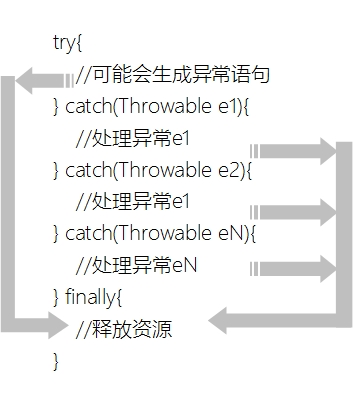

## 14.4 释放资源

有时在try-catch语句中会占用一些非Java资源，如：打开文件、网络连接、打开数据库连接和使用数据结果集等，这些资源并非Java资源，不能通过JVM的垃圾收集器回收，需要程序员释放。为了确保这些资源能够被释放可以使用finally代码块或Java 7之后提供自动资源管理（Automatic Resource Management）技术。

### 14.4.1 finally代码块

try-catch语句后面还可以跟有一个finally代码块，try-catch-finally语句语法如下：


```java

try{
    //可能会生成异常语句
} catch(Throwable e1){
    //处理异常e1
} catch(Throwable e2){
    //处理异常e1
} catch(Throwable eN){
    //处理异常eN    
} finally{
    //释放资源
}

```


无论try正常结束还是catch异常结束都会执行finally代码块，如同14-2所示。



图14-2　finally代码块流程

使用finally代码块示例代码如下：

```java
//HelloWorld.java文件
package com.a51work6;
...
public class HelloWorld {

	public static void main(String[] args) {
		Date date = readDate();
		System.out.println("读取的日期  = " + date);
	}

	public static Date readDate() {

		FileInputStream readfile = null;
		InputStreamReader ir = null;
		BufferedReader in = null;
		try {
			readfile = new FileInputStream("readme.txt");
			ir = new InputStreamReader(readfile);
			in = new BufferedReader(ir);
			// 读取文件中的一行数据
			String str = in.readLine();
			if (str == null) {
				return null;
			}

			DateFormat df = new SimpleDateFormat("yyyy-MM-dd");
			Date date = df.parse(str);
			return date;

		} catch (FileNotFoundException e) {
			System.out.println("处理FileNotFoundException...");
			e.printStackTrace();
		} catch (IOException e) {
			System.out.println("处理IOException...");
			e.printStackTrace();
		} catch (ParseException e) {
			System.out.println("处理ParseException...");
			e.printStackTrace();
		} finally {	 ①
			try {
				if (readfile != null) {
					readfile.close();②
				}
			} catch (IOException e) {	
				e.printStackTrace();
			}
			try {
				if (ir != null) {
					ir.close();	③
				}
			} catch (IOException e) {
				e.printStackTrace();
			}
			try {
				if (in != null) {
					in.close();	④
				}
			} catch (IOException e) {
				e.printStackTrace();
			}
		}  ⑤

		return null;
	}
}

```


上述代码第①行~第⑤行是finally语句，在这里通过关闭流释放资源，FileInputStream、InputStreamReader和BufferedReader是三个输入流，它们都需要关闭，见代码第②行~第④行通过流的close()关闭流，但是流的close()方法还有可以能发生IOException异常，所以这里又针对每一个close()语句还需要进行捕获处理。

**注意 为了代码简洁等目的，可能有的人会将finally代码中的多个嵌套的try-catch语句合并，例如将上述代码改成如下形式，将三个有可以发生异常的close()方法放到一个try-catch。读者自己考虑一下这处理是否稳妥呢？每一个close()方法对应关闭一个资源，如果第一个close()方法关闭时发生了异常，那么后面的两个也不会关闭，因此如下的程序代码是有缺陷的。**


```java
try {
    ... 
} catch (FileNotFoundException e) {
    ... 
} catch (IOException e) {
    ... 
} catch (ParseException e) {
    ...
} finally {
    try {
        if (readfile != null) {
            readfile.close();
        }
        if (ir != null) {
            ir.close();
        }
        if (in != null) {
            in.close();
        }
    } catch (IOException e) {
        e.printStackTrace();
    }
}

```


### 14.4.2 自动资源管理

14.4.1节使用finally代码块释放资源会导致程序代码大量增加，一个finally代码块往往比正常执行的程序还要多。在Java 7之后提供自动资源管理（Automatic Resource Management）技术，可以替代finally代码块，优化代码结构，提高程序可读性。

自动资源管理是在try语句上的扩展，语法如下：

```java
try (声明或初始化资源语句) {
	//可能会生成异常语句
} catch(Throwable e1){
	//处理异常e1
} catch(Throwable e2){
	//处理异常e1
} catch(Throwable eN){
	//处理异常eN
}
```

在try语句后面添加一对小括号“()”，其中是声明或初始化资源语句，可以有多条语句语句之间用分号“;”分隔。

示例代码如下：

```java
//HelloWorld.java文件
package com.a51work6;
...
public class HelloWorld {

	public static void main(String[] args) {
		Date date = readDate();
		System.out.println("读取的日期  = " + date);
	}

	public static Date readDate() {

		// 自动资源管理
		try (FileInputStream readfile = new FileInputStream("readme.txt"); ①
				InputStreamReader ir = new InputStreamReader(readfile); ②
				BufferedReader in = new BufferedReader(ir)) { ③

			// 读取文件中的一行数据
			String str = in.readLine();
			if (str == null) {
				return null;
			}

			DateFormat df = new SimpleDateFormat("yyyy-MM-dd");
			Date date = df.parse(str);
			return date;

		} catch (FileNotFoundException e) {
			System.out.println("处理FileNotFoundException...");
			e.printStackTrace();
		} catch (IOException e) {
			System.out.println("处理IOException...");
			e.printStackTrace();
		} catch (ParseException e) {
			System.out.println("处理ParseException...");
			e.printStackTrace();
		}
		
		return null;
	}

}

```

上述代码第①行~第③行是声明或初始化三个输入流，三条语句放到在try语句后面小括号中，语句之间用分号“;”分隔，这就是自动资源管理技术了，采用了自动资源管理后不再需要finally代码块，不需要自己close这些资源，释放过程交给了JVM。

**注意 所有可以自动管理的资源需要实现AutoCloseable接口，上述代码中三个输入流FileInputStream、InputStreamReader和BufferedReader从Java 7之后实现AutoCloseable接口，具体哪些资源实现AutoCloseable接口需要查询API文档。**