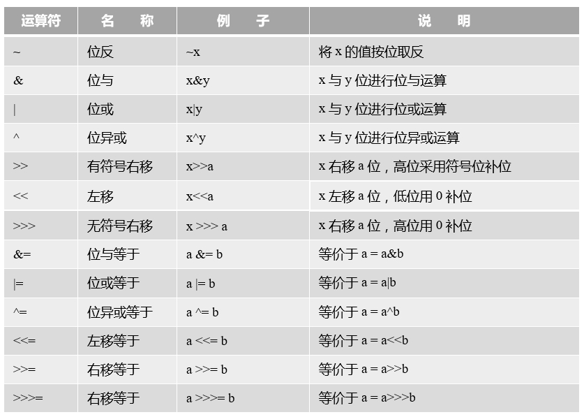

## 6.4 位运算符

位运算是以二进位（bit）为单位进行运算的，操作数和结果都是整型数据。位运算符有如下几个运算符：&amp;、|、^、~、&gt;&gt;、&lt;&lt;和&gt;&gt;&gt;，以及相应的赋值运算符，具体说明参见表6-6。

表6-6 位运算符


**注意 无符号右移&gt;&gt;&gt;运算符仅被允许用在int和long整数类型, 如果用于short或byte数据, 则数据在位移之前，转换为int类型后再进行位移计算。
**
位运算示例代码：

```java
byte a = 0B00110010;	//十进制50					①
byte b = 0B01011110;	//十进制94					②

System.out.println("a | b = " + (a | b)); 	// 0B01111110	③
System.out.println("a & b = " + (a & b)); 	// 0B00010010	④
System.out.println("a ^ b = " + (a ^ b)); 	// 0B01101100	⑤
System.out.println("~b = " + (~b)); 		// 0B10100001	⑥

System.out.println("a >> 2 = " + (a >> 2)); 	// 0B00001100	⑦
System.out.println("a >> 1 = " + (a >> 1)); 	// 0B00011001	⑧
System.out.println("a >>> 2 = " + (a >>> 2)); 	// 0B00001100	⑨
System.out.println("a << 2 = " + (a << 2)); 	// 0B11001000	⑩
System.out.println("a << 1 = " + (a << 1)); 	// 0B01100100	⑪

int c = -12; 									⑫
System.out.println("c >>> 2 = " + (c >>> 2)); 	⑬
System.out.println("c >> 2 = " + (c >> 2)); 	⑭
```

输出结果如下： 

    a | b = 126
    a & b = 18
    a ^ b = 108
    ~b = -95
    a >> 2 = 12
    a >> 1 = 25
    a >>> 2 = 12
    a << 2 = 200
    a << 1 = 100
    c >>> 2 = 1073741821
    c >> 2 = -3
    
上述代码第①行和第②行分别定义了byte变量a和b，为了便于查看代码采用二进制整数表示。

代码第③行中表达式(a | b)进行位或运算，结果是二进制的0B01111110。a和b按位进行或计算，只要有一个为1，这一位就为1，否则为0。

代码第④行(a &amp; b)是进行位与运算，结果是二进制的0B00010010。a和b按位进行与计算，只有两位全部为1，这一位才为1，否则为0。

代码第⑤行(a ^ b)是进行位异或运算，结果是二进制的0B01101100。a和b按位进行异或计算，只有两位相反时这一位才为1，否则为0。

代码第⑦行(a &gt;&gt; 2)是进行有符号右位移2位运算，结果是二进制的0B00001100。a的低位被移除掉，由于是正数符号位是0，高位空位用0补。类似代码第⑧行(a &gt;&gt; 1)是进行右位移1位运算，结果是二进制的0B00011001。

代码第⑨行(a &gt;&gt;&gt; 2)是进行无符号右位移2位运算，与代码第⑦行不同的是，无论是否有数符号位，高位空位用0补，所以在正数情况下&gt;&gt;和&gt;&gt;&gt;运算结果是一样的。

代码第⑩行(a &lt;&lt; 2)是进行左位移2位运算，结果是二进制的0B11001000。a的高位被移除掉，低位用0补位。类似代码第⑪行(a &lt;&lt; 1)是进行左位移1位运算，结果是二进制的0B01100100。

代码第⑫声明int类型负数。右位移（&gt;&gt;&gt;和&gt;&gt;）在负数情况下差别比较大。代码第⑬行的(c &gt;&gt;&gt; 2)表达式输出结果是1073741821，这是一个如此大的正数，从一个负数变成一个正数，这说明无符号右位移对于负数计算会导致精度的丢失。而有符号右位移对于负数的计算是正确的，见代码第⑭行。

**提示 有符号右移n位，相当于操作数除以2<sup>n</sup>，例如代码第⑦行(a &gt;&gt; 2)表达式相当于(a / 2<sup>2</sup>)，a = 50所以结果等于12，类似的还有代码第⑧行和第⑭行。另外，左位移n位，相当于操作数乘以2<sup>n</sup>，例如代码第⑩行(a &lt;&lt; 2)表达式相当于(a * 2<sup>2</sup>)，a = 50所以结果等于200，类似的还有代码第⑪行。**