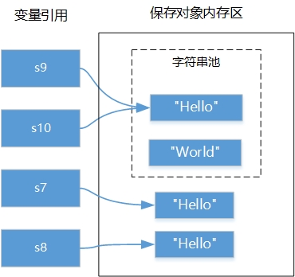

## 9.3 不可变字符串

很多计算机语言都提供了两种字符串，即不可变字符串和可变字符串，它们区别在于当字符串进行拼接等修改操作时，不可变字符串会创建新的字符串对象，而可变字符串不会创建新对象。

### 9.3.1 String {#string}

Java中不可变字符串类是String，属于java.lang包，它也是Java非常重要的类。

**提示 java.lang包中提供了很多Java基础类，包括Object、Class、String和Math等基本类。在使用java.lang包中的类时不需要引入（import）该包，因为它是由解释器自动引入的。当然引入java.lang包程序也不会有编译错误。**

创建String对象可以通过构造方法实现，常用的构造方法：

*   String()：使用空字符串创建并初始化一个新的String对象。
*   String(String original)：使用另外一个字符串创建并初始化一个新的 String 对象。
*   String(StringBuffer buffer)：使用可变字符串对象（StringBuffer）创建并初始化一个新的 String 对象。
*   String(StringBuilder builder)：使用可变字符串对象（StringBuilder）创建并初始化一个新的 String 对象。
*   String(byte[] bytes)：使用平台的默认字符集解码指定的byte数组，通过byte数组创建并初始化一个新的 String 对象。
*   String(char[] value)：通过字符数组创建并初始化一个新的 String 对象。
*   String(char[] value, int offset, int count)：通过字符数组的子数组创建并初始化一个新的 String 对象；offset参数是子数组第一个字符的索引，count参数指定子数组的长度。

创建字符串对象示例代码如下：

```java
// 创建字符串对象
String s1 = new String();
String s2 = new String("Hello World");
String s3 = new String("\u0048\u0065\u006c\u006c\u006f\u0020\u0057\u006f\u0072\u006c\u0064");
System.out.println("s2 = " + s2);
System.out.println("s3 = " + s3);		

char chars[] = { 'a', 'b', 'c', 'd', 'e' };
// 通过字符数组创建字符串对象
String s4 = new String(chars);
// 通过子字符数组创建字符串对象
String s5 = new String(chars, 1, 4);
System.out.println("s4 = " + s4);
System.out.println("s5 = " + s5);

byte bytes[] = { 97, 98, 99 };
// 通过byte数组创建字符串对象
String s6 = new String(bytes);
System.out.println("s6 = " + s6);
System.out.println("s6字符串长度 = " + s6.length());

```

输出结果：

    s2 = Hello World
    s3 = Hello World
    s4 = abcde
    s5 = bcde
    s6 = abc
    s6字符串长度 = 3
    
上述代码中s2和s3都是表示Hello World字符串，获得字符串长度方法是length()，其他代码比较简单，这里不再赘述。

### 9.3.2 字符串池 {#-0}

在前面的学习过程中细心的读者可能会发现，前面的示例代码中获得字符串对象时都是直接使用字符串常量，但Java中对象是使用new关键字创建，字符串对象也可以使用new关键字创建，代码如下：

```java
String s9 = "Hello";			//字符串常量
String s7 = new String("Hello");//使用new关键字创建

```

使用new关键字与字符串常量都能获得字符串对象，但它们之间有一些区别。先看下面代码运行结果：

```java
String s7 = new String("Hello");		①
String s8 = new String("Hello");		②

String s9 = "Hello";						③
String s10 = "Hello";					④

System.out.printf("s7 == s8 : %b%n", s7 == s8);
System.out.printf("s9 == s10: %b%n", s9 == s10);
System.out.printf("s7 == s9 : %b%n", s7 == s9);
System.out.printf("s8 == s9 : %b%n", s8 == s9);

```

输出结果：

    s7 == s8 : false
    s9 == s10: true
    s7 == s9 : false
    s8 == s9 : false
    
==运算符比较的是两个引用是否指向相同的对象，从上面的运行结果可见，s7和s8指的是不同对象，s9和s10指向的是相同对象。

这是为什么？Java中的不可变字符串String常量，采用字符串池（String Pool）管理技术，字符串池是一种字符串驻留技术。采用字符串常量赋值时（见代码第③行），如图9-5所示，会字符串池中查找&quot;Hello&quot;字符串常量，如果已经存在把引用赋值给s9，否则创建&quot;Hello&quot;字符串对象，并放到池中。根据此原理，可以推定s10与s9是相同的引用，指向同一个对象。但此原理并不适用于new所创建的字符串对象，代码运行到第①行后，会创建&quot;Hello&quot;字符串对象，而它并没有放到字符串池中。代码第②行又创建了一个新的&quot;Hello&quot;字符串对象，s7和s8是不同的引用，指向不同的对象。



图9-5　字符串池

### 9.3.3 字符串拼接 {#-1}

String字符串虽然是不可变字符串，但也可以进行拼接只是会产生一个新的对象。String字符串拼接可以使用+运算符或String的concat(String str)方法。+运算符优势是可以连接任何类型数据拼接成为字符串，而concat方法只能拼接String类型字符串。

字符串拼接示例如下：

```java
String s1 = "Hello";
// 使用+运算符连接
String s2 = s1 + " ";		①
String s3 = s2 + "World";	②
System.out.println(s3);

String s4 = "Hello";
// 使用+运算符连接，支持+=赋值运算符
s4 += " ";										③			
s4 += "World";	④
System.out.println(s4);

String s5 = "Hello";
// 使用concat方法连接
s5 = s5.concat(" ").concat("World");	⑤
System.out.println(s5);

int age = 18;
String s6= "她的年龄是" + age + "岁。";	⑥
System.out.println(s6);

char score = 'A';
String s7= "她的英语成绩是" + score;	⑦
System.out.println(s7);

java.util.Date now = new java.util.Date();⑧
//对象拼接自动调用toString()方法
String s8= "今天是：" + now;	⑨
System.out.println(s8);
```


输出结果：

    Hello World
    Hello World
    Hello World
    她的年龄是18岁。
    她的英语成绩是A
    今天是：Thu May 25 16:25:40 CST 2017


上述代码第①~②行使用+运算符进行字符串的拼接，其中产生了三个对象。代码第③~④行业是使用+=赋值运算符，本质上也是+运算符进行拼接。

代码第⑤行采用concat方法进行拼接，该方法的完整定义如下：

```java
public String concat(String str)
```

它的参数和返回值都是String，因此代码第⑤行可以连续调用该方法进行多个字符串的拼接。

代码第⑥和第⑦行是使用+运算符，将字符串与其他类型数据进行的拼接。代码第⑨行是与对象可以进行拼接，Java中所有对象都有一个toString()方法，该方法可以将对象转换为字符串，拼接过程会调用该对象的toString()方法，将该对象转换为字符串后再进行拼接。代码第⑧行的java.util.Date类是Java SE提供的日期类。

### 9.3.4 字符串查找 {#-2}

在给定的字符串中查找字符或字符串是比较常见的操作。在String类中提供了indexOf和lastIndexOf方法用于查找字符或字符串，返回值是查找的字符或字符串所在的位置，-1表示没有找到。这两个方法有多个重载版本：

*   int indexOf(int ch)：从前往后搜索字符ch，返回第一次找到字符ch所在处的索引。
*   int indexOf(int ch, int fromIndex)：从指定的索引开始从前往后搜索字符ch，返回第一次找到字符ch所在处的索引。
*   int indexOf(String str)：从前往后搜索字符串str，返回第一次找到字符串所在处的索引。
*   int indexOf(String str, int fromIndex)：从指定的索引开始从前往后搜字符串str，返回第一次找到字符串所在处的索引。
*   int lastIndexOf(int ch)：从后往前搜索字符ch，返回第一次找到字符ch所在处的索引。
*   int lastIndexOf(int ch, int fromIndex)：从指定的索引开始从后往前搜索字符ch，返回第一次找到字符ch所在处的索引。
*   int lastIndexOf(String str)：从后往前搜索字符串str，返回第一次找到字符串所在处的索引。
*   int lastIndexOf(String str, int fromIndex)：从指定的索引开始从后往前搜索字符串str，返回第一次找到字符串所在处的索引。

**提示 字符串本质上是字符数组，因此它也有索引，索引从零开始。String的charAt(int index)方法可以返回索引index所在位置的字符。
**
字符串查找示例代码如下：

```java
String sourceStr = "There is a string accessing example.";

//获得字符串长度
int len = sourceStr.length();
//获得索引位置16的字符
char ch = sourceStr.charAt(16);

//查找字符和子字符串
int firstChar1 = sourceStr.indexOf('r');
int lastChar1 = sourceStr.lastIndexOf('r');
int firstStr1 = sourceStr.indexOf("ing");
int lastStr1 = sourceStr.lastIndexOf("ing");
int firstChar2 = sourceStr.indexOf('e', 15);
int lastChar2 = sourceStr.lastIndexOf('e', 15);
int firstStr2 = sourceStr.indexOf("ing", 5);
int lastStr2 = sourceStr.lastIndexOf("ing", 5);

System.out.println("原始字符串:" + sourceStr);
System.out.println("字符串长度:" + len);
System.out.println("索引16的字符:" + ch);
System.out.println("从前往后搜索r字符，第一次找到它所在索引:" + firstChar1);
System.out.println("从后往前搜索r字符，第一次找到它所在的索引:" + lastChar1);
System.out.println("从前往后搜索ing字符串，第一次找到它所在索引:" + firstStr1);
System.out.println("从后往前搜索ing字符串，第一次找到它所在索引:" + lastStr1);
System.out.println("从索引为15位置开始，从前往后搜索e字符，第一次找到它所在索引:" + firstChar2);
System.out.println("从索引为15位置开始，从后往前搜索e字符，第一次找到它所在索引:" + lastChar2);
System.out.println("从索引为5位置开始，从前往后搜索ing字符串，第一次找到它所在索引:" + firstStr2);
System.out.println("从索引为5位置开始，从后往前搜索ing字符串，第一次找到它所在索引:" + lastStr2);

```

输出结果：

    原始字符串:There is a string accessing example.
    字符串长度:36
    索引16的字符:g
    从前往后搜索r字符，第一次找到它所在索引:3
    从后往前搜索r字符，第一次找到它所在的索引:13
    从前往后搜索ing字符串，第一次找到它所在索引:14
    从后往前搜索ing字符串，第一次找到它所在索引:24
    从索引为15位置开始，从前往后搜索e字符，第一次找到它所在索引:21
    从索引为15位置开始，从后往前搜索e字符，第一次找到它所在索引:4
    从索引为5位置开始，从前往后搜索ing字符串，第一次找到它所在索引:14
    从索引为5位置开始，从后往前搜索ing字符串，第一次找到它所在索引:-1
    
sourceStr字符串索引如图9-6所示。上述字符串查找方法比较类似，这里重点解释一下sourceStr.indexOf(&quot;ing&quot;, 5)和sourceStr.lastIndexOf(&quot;ing&quot;, 5)表达式。从图9-6可见ing字符串出现过两次，索引分别是14和24。sourceStr.indexOf(&quot;ing&quot;, 5)表达式从索引为5的字符（&quot; &quot;）开始从前往后搜索，结果是找到第一个ing（索引为14），返回值为14。sourceStr.lastIndexOf(&quot;ing&quot;, 5)表达式从索引为5的字符（&quot; &quot;）开始从后往前搜索，没有找到，返回值为-1。


图9-6　sourceStr字符串索引

### 字符串比较 {#-3}

字符串比较是常见的操作，包括比较相等、比较大小、比较前缀和后缀串等。

#####1.  比较相等

String提供的比较字符串相等的方法：

*   boolean equals(Object anObject)：比较两个字符串中内容是否相等。
*   boolean equalsIgnoreCase(String anotherString)：类似equals方法，只是忽略大小写。

#####2.  比较大小

有时不仅需要知道是否相等，还要知道大小，String提供的比较大小的方法：

*   int compareTo(String anotherString)：按字典顺序比较两个字符串。如果参数字符串等于此字符串，则返回值 0；如果此字符串小于字符串参数，则返回一个小于 0 的值；如果此字符串大于字符串参数，则返回一个大于 0 的值。
*   int compareToIgnoreCase(String str)：类似compareTo，只是忽略大小写。

#####3.  比较前缀和后缀

*   boolean endsWith(String suffix)：测试此字符串是否以指定的后缀结束。
*   boolean startsWith(String prefix)：测试此字符串是否以指定的前缀开始。

字符串比较示例代码如下：

```java
String s1 = new String("Hello");
String s2 = new String("Hello");
// 比较字符串是否是相同的引用
System.out.println("s1 == s2 : " + (s1 == s2));
// 比较字符串内容是否相等
System.out.println("s1.equals(s2) : " + (s1.equals(s2)));

String s3 = "HELlo";
// 忽略大小写比较字符串内容是否相等
System.out.println("s1.equalsIgnoreCase(s3) : " + (s1.equalsIgnoreCase(s3)));

// 比较大小
String s4 = "java";
String s5 = "Swift";
// 比较字符串大小 s4 > s5
System.out.println("s4.compareTo(s5) : " + (s4.compareTo(s5)));						①
// 忽略大小写比较字符串大小 s4 < s5
System.out.println("s4.compareToIgnoreCase(s5) : " + (s4.compareToIgnoreCase(s5)));		②

// 判断文件夹中文件名
String[] docFolder = { "java.docx", " JavaBean.docx", "Objecitve-C.xlsx", "Swift.docx " };		
int wordDocCount = 0;
// 查找文件夹中Word文档个数
for (String doc : docFolder) {
	// 去的前后空格
	doc = doc.trim();						③
	// 比较后缀是否有.docx字符串
	if (doc.endsWith(".docx")) {
		wordDocCount++;
	}
}
System.out.println("文件夹中Word文档个数是： " + wordDocCount);

int javaDocCount = 0;
// 查找文件夹中Java相关文档个数
for (String doc : docFolder) {
	// 去的前后空格
	doc = doc.trim();
	// 全部字符转成小写
	doc = doc.toLowerCase();				④
	// 比较前缀是否有java字符串
	if (doc.startsWith("java")) {
		javaDocCount++;
	}
}
System.out.println("文件夹中Java相关文档个数是：" + javaDocCount);

```

输出结果：

    s1 == s2 : false
    s1.equals(s2) : true
    s1.equalsIgnoreCase(s3) : true
    s4.compareTo(s5) : 23
    s4.compareToIgnoreCase(s5) : -9
    文件夹中Word文档个数是： 3
    文件夹中Java相关文档个数是：2
    

上述代码第①行的compareTo方法按字典顺序比较两个字符串，s4.compareTo(s5)表达式返回结果大于0，说明s4大于s5，字符在字典中顺序事实上就它的Unicode编码，先比较两个字符串的第一个字符j和S，j的Unicode编码是106，S的Unicode编码是83，所以可以得出结论s4 &gt; s5。代码第②行是忽略大小写时，要么全部当成小写字母进行比较，要么当前成全部大写字母进行比较，无论哪种比较结果都是一样的s4 &lt; s5。

代码第③行trim()方法可以去除字符串前后空白。代码第④行toLowerCase()方法可以将此字符串全部转化为小写字符串，类似的方法还有toLowerCase()方法，可将字符串全部转化为小写字符串。

### 9.3.6 字符串截取 {#-4}

Java中字符串String截取方法主要的方法如下：

*   String substring(int beginIndex)：从指定索引beginIndex开始截取一直到字符串结束的子字符串。
*   String substring(int beginIndex, int endIndex)：从指定索引beginIndex开始截取直到索引endIndex - 1处的字符，注意包括索引为beginIndex处的字符，但不包括索引为endIndex处的字符。

字符串截取方法示例代码如下：

```java
String sourceStr = "There is a string accessing example.";
// 截取example.子字符串
String subStr1 = sourceStr.substring(28); ①
// 截取string子字符串
String subStr2 = sourceStr.substring(11, 17);	②
System.out.printf("subStr1 = %s%n", subStr1);
System.out.printf("subStr2 = %s%n",subStr2);

// 使用split方法分割字符串
System.out.println("-----使用split方法-----");
String[] array = sourceStr.split(" ");	 ③
for (String str : array) {
    System.out.println(str);
}
```
输出结果：

    subStr1 = example.
    subStr2 = string
    -----使用split方法-----
    There
    is
    a
    string
    accessing
    example.
    

上述sourceStr字符串索引参考图9-6所示。代码第①行是截取example.子字符串，从图9-6可见e字符索引是28, 从索引28字符截取直到sourceStr结尾。代码第②行是截取string子字符串，从图9-6可见，s字符索引是11，g字符索引是16，endIndex参数应该17。

另外，String还提供了字符串分割方法，见代码第③行split(&quot; &quot;)方法，参数是分割字符串，返回值String[]。